# Nuxeo Studio Community Cookbook

This repository aims at helping the Nuxeo Community to enrich Nuxeo Studio projects. It provides a list of features and visual elements ready to be copy-pasted. The modules are for **LTS 2019**:

- They can be unrelated to the UI (to provide new backend features, such as utilities to handle multimedia files, specific conversions, email templates etc.).
- They can provide UI elements for Nuxeo Web UI, or any frontend application.

## Module listing

- [Latest Modules](#latest-modules)
- [Tips and Tricks](#tips-and-tricks)
- [Layouts](#layouts)
- [DAM](#dam)
- [AI](#ai)
- [Security / Authentication / User and Group Management](#security--authentication--user-and-group-management)
- [Reporting](#reporting)
- [Business Logics](#business-logics)
- [Templates](#templates)
- [Integrations](#integrations)

:information_source: Click on the module thumbnail to view the module contributions.

### Latest Modules

<table style="width:100%">
  <tr style="font-weight:bold">
    <th>Module</th>
    <th>Description</th>
    <th>Author</th>
    <th>Category</th>
  </tr>
  <tr>
    <td><a href="https://github.com/nuxeo/nuxeo-studio-community-cookbook/tree/master/modules/nuxeo/create-from-template"></a></td>
    <td>Create from template</td>
    <td>Nuxeo</td>
    <td>Templates</td>
  </tr>
  <tr>
    <td><a href="https://github.com/nuxeo/nuxeo-studio-community-cookbook/tree/master/modules/nuxeo/geodistance-search-and-google-map"></a></td>
    <td>Geodistance Search + Google Map</td>
    <td>Nuxeo</td>
    <td>Layouts, Search, Automation</td>
  </tr>
  <tr>
    <td><a href="https://github.com/nuxeo/nuxeo-studio-community-cookbook/tree/master/modules/nuxeo/send-email-from-webui">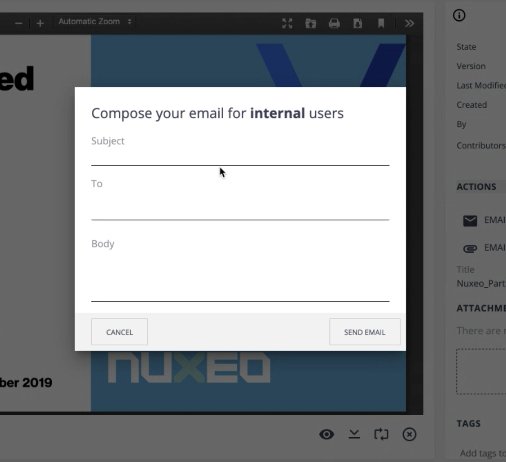</a></td>
    <td>Send emails from Nuxeo Web UI</td>
    <td>Nuxeo</td>
    <td>Mail, Layouts, Automation, Templates</td>
  </tr>
  <tr>
    <td><a href="https://github.com/nuxeo/nuxeo-studio-community-cookbook/tree/master/modules/nuxeo/currency">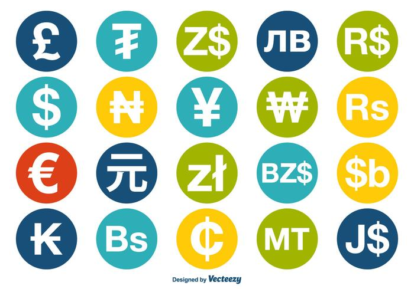</a></td>
    <td>Display a field with Currency format</td>
    <td>Nuxeo</td>
    <td>Layout</td>
  </tr>
</table>


### Tips and Tricks

<table width="100%">
  <tr style="font-weight:bold">
    <th>Module</th>
    <th>Description</th>
    <th>Author</th>
  </tr>
  <tr>
    <td><a href="https://github.com/nuxeo/nuxeo-studio-community-cookbook/blob/master/modules/nuxeo/modeler-tips-tricks">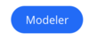</a></td>
    <td>Tips and tricks to implement backend logics with Studio Modeler</td>
    <td>Nuxeo</td>
  </tr>
  <tr>
    <td><a href="https://github.com/nuxeo/nuxeo-studio-community-cookbook/blob/master/modules/nuxeo/designer-tips-tricks">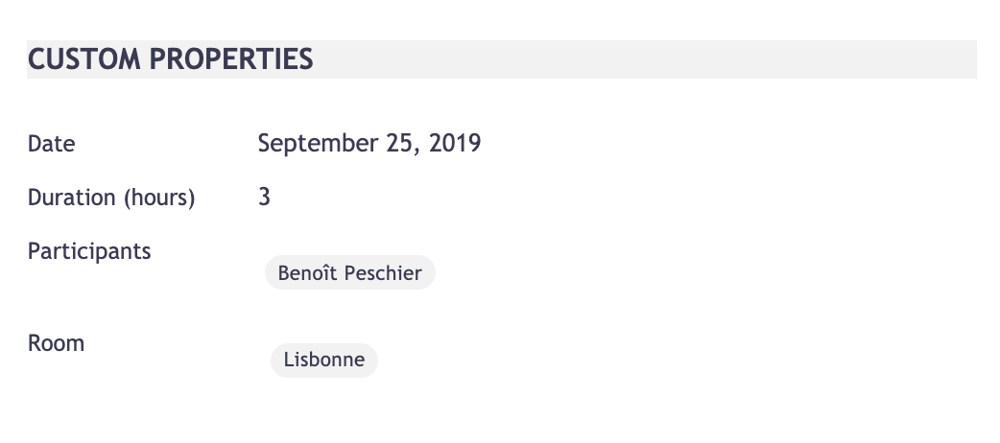</a></td>
    <td>Tips and tricks to design elements within Studio Designer</td>
    <td>Nuxeo</td>
  </tr>
  <tr>
    <td><a href="https://github.com/nuxeo/nuxeo-studio-community-cookbook/blob/master/modules/nuxeo/automation-script-utils">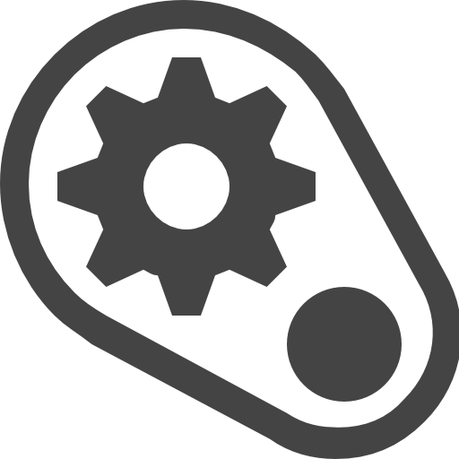</a></td>
    <td>Automation Script Utilities</td>
    <td>Nuxeo</td>
  </tr>
</table>

### Layouts

Module | Description | Contributor
--- | --- | ---
<a href="https://github.com/nuxeo/nuxeo-studio-community-cookbook/tree/master/modules/nuxeo/geodistance-search-and-google-map"></a> | Geodistance Search + Google Map | Nuxeo
<a href="https://github.com/nuxeo/nuxeo-studio-community-cookbook/blob/master/modules/nuxeo/currency"></a> | Display a field with Currency format | Nuxeo
<a href="https://github.com/nuxeo/nuxeo-studio-community-cookbook/blob/master/modules/nuxeo/cascading-fields">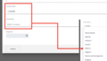</a> | Cascading Fields in Document Layouts | Nuxeo
<a href="https://github.com/nuxeo/nuxeo-studio-community-cookbook/blob/master/modules/nuxeo/highlight"></a> | Highlight in Custom Searches | Nuxeo
<a href="https://github.com/nuxeo/nuxeo-studio-community-cookbook/blob/master/modules/nuxeo/eml-previewer">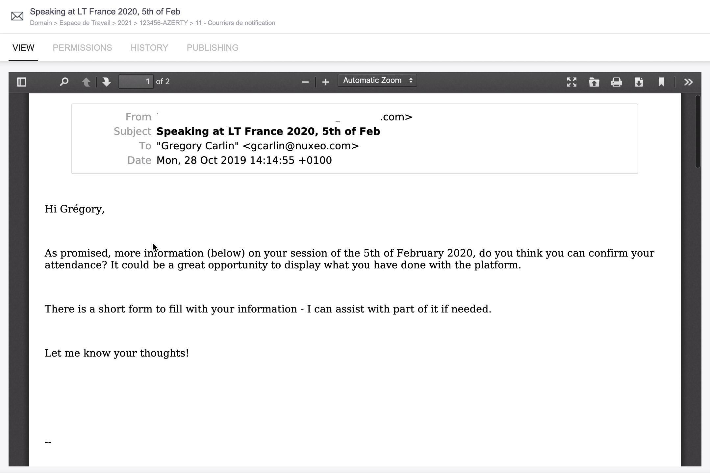</a> | Display EML Preview | Nuxeo
<a href="https://github.com/nuxeo/nuxeo-studio-community-cookbook/blob/master/modules/nuxeo/progress-bar">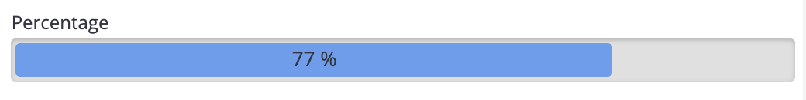</a> | Add a progress bar | Nuxeo
<a href="https://github.com/nuxeo/nuxeo-studio-community-cookbook/blob/master/modules/nuxeo/inject-html"></a> | Inject HTML into a page using bound data | Nuxeo
<a href="https://github.com/nuxeo/nuxeo-studio-community-cookbook/blob/master/modules/nuxeo/document-suggestion-result-formatters">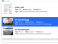</a> | Custom Nuxeo Suggestion Display | Nuxeo
<a href="https://github.com/nuxeo/nuxeo-studio-community-cookbook/blob/master/modules/nuxeo/collapse"></a> | Collapsible Element | Nuxeo
<a href="https://github.com/nuxeo/nuxeo-studio-community-cookbook/blob/master/modules/nuxeo/toggleable-form">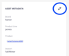</a> | Inline card property Editing | Nuxeo
<a href="https://github.com/nuxeo/nuxeo-studio-community-cookbook/blob/master/modules/nuxeo/salesforce-ui">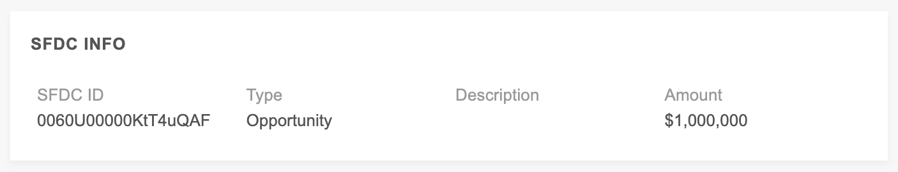</a> | Display Salesforce metadata | Nuxeo
<a href="https://github.com/nuxeo/nuxeo-studio-community-cookbook/blob/master/modules/nuxeo/ssn">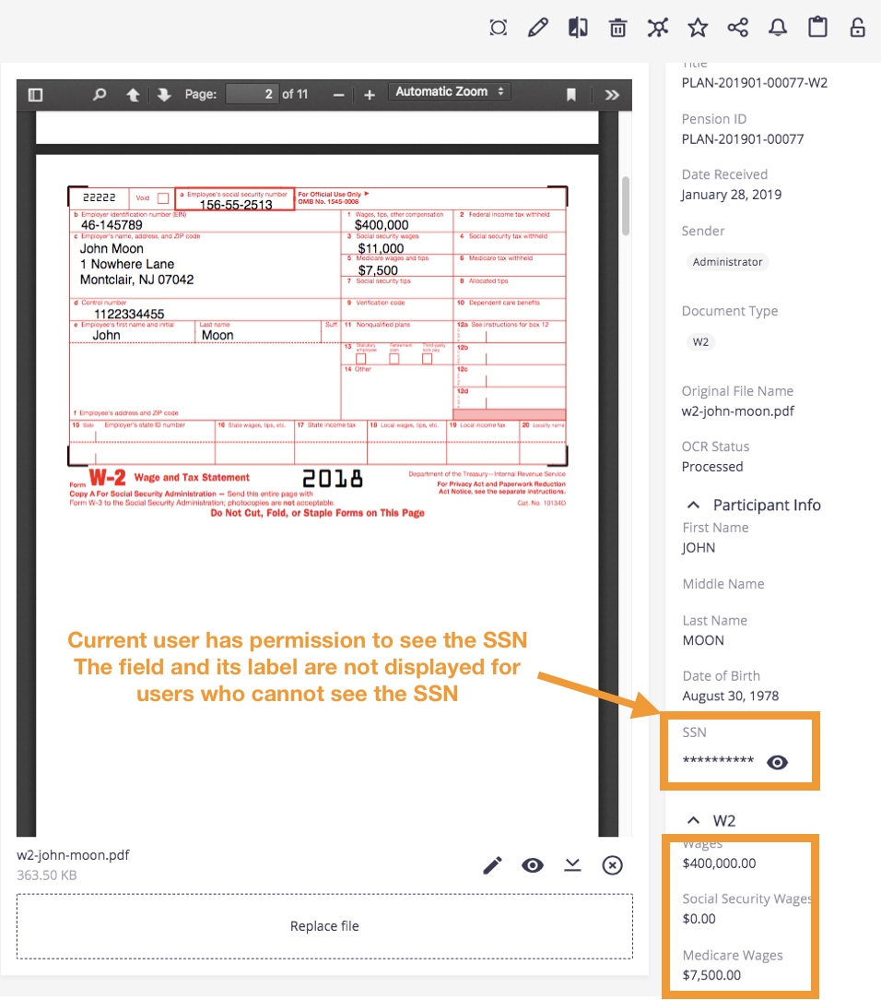</a> | Show/hide the value of a secret field | Nuxeo
<a href="https://github.com/nuxeo/nuxeo-studio-community-cookbook/blob/master/modules/nuxeo/related-documents">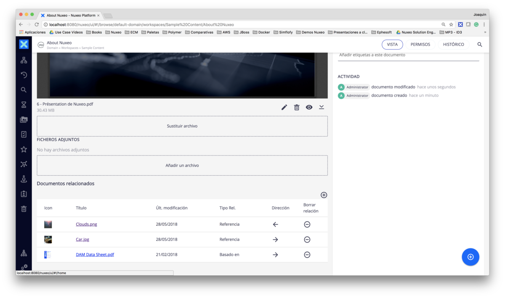</a> | Display Document Relations | Nuxeo
<a href="https://github.com/nuxeo/nuxeo-studio-community-cookbook/blob/master/modules/nuxeo/barcode-widget">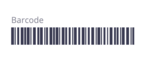</a> | Display text using barcode font | Nuxeo
<a href="https://github.com/nuxeo/nuxeo-studio-community-cookbook/blob/master/modules/nuxeo/geodistance-search-and-google-map"></a> | Geodistance Search + Google Map | Nuxeo

### DAM

Module | Description | Contributor
--- | --- | ---
<a href="https://github.com/nuxeo/nuxeo-studio-community-cookbook/blob/master/modules/nuxeo/video-thumbnail"></a> | Sets the video poster and search thumbnail | Nuxeo
<a href="https://github.com/nuxeo/nuxeo-studio-community-cookbook/blob/master/modules/nuxeo/video-conversions"></a> | Additional video conversions | Nuxeo

### AI

Module | Description | Contributor
--- | --- | ---
<a href="https://github.com/nuxeo/nuxeo-studio-community-cookbook/blob/master/modules/nuxeo/google-vision-ocr">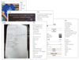</a> | Extract text from an image-based PDF with Google Vision | Nuxeo
<a href="https://github.com/nuxeo/nuxeo-studio-community-cookbook/blob/master/modules/nuxeo/sensitive-data">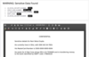</a> | Display sensitive data details contained in a document | Nuxeo

### Security / Authentication / User and Group Management

Module | Description | Contributor
--- | --- | ---
<a href="https://github.com/nuxeo/nuxeo-studio-community-cookbook/blob/master/modules/nuxeo/bulk-workflow-reassignment"></a> | Bulk Workflow Reassignment | Nuxeo
<a href="https://github.com/nuxeo/nuxeo-studio-community-cookbook/blob/master/modules/nuxeo/saml-user-mapping">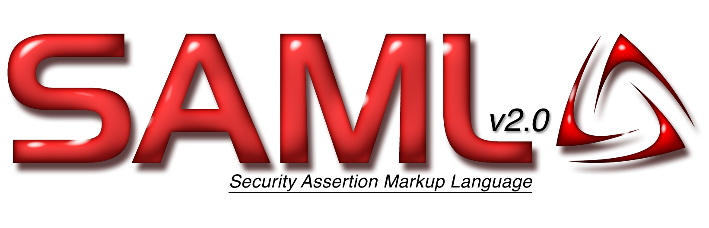</a> | Map SAML user attributes to Nuxeo | Nuxeo
<a href="https://github.com/nuxeo/nuxeo-studio-community-cookbook/blob/master/modules/nuxeo/sensitive-data"></a> | Display sensitive data details contained in a document | Nuxeo
<a href="https://github.com/nuxeo/nuxeo-studio-community-cookbook/blob/master/modules/nuxeo/ssn"></a> | Show/hide the value of a secret field | Nuxeo

### Reporting

Module | Description | Contributor
--- | --- | ---
<a href="https://github.com/nuxeo/nuxeo-studio-community-cookbook/blob/master/modules/nuxeo/workflow-status">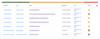</a> | Monitor workflow instances status | Nuxeo
<a href="https://github.com/nuxeo/nuxeo-studio-community-cookbook/blob/master/modules/nuxeo/project-metrics">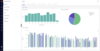</a> | Display Kibana dashboards in the "Analytics" menu | Nuxeo
<a href="https://github.com/nuxeo-sandbox/nuxeo-generic-dashboard-studio-template">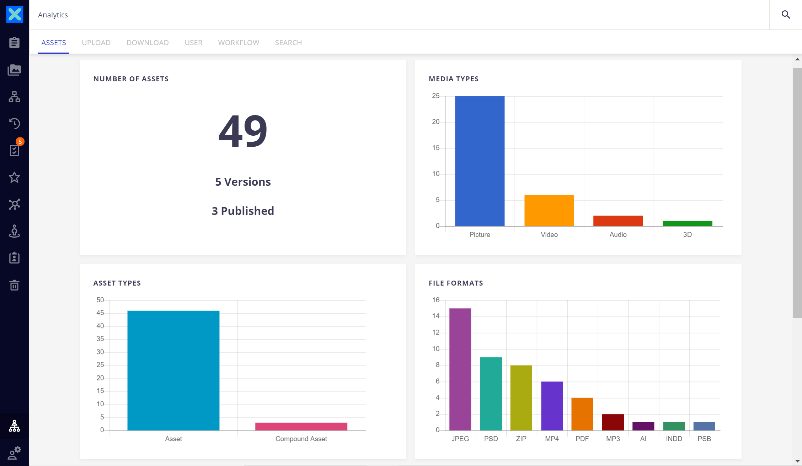</a> | Generic Web UI Analytic Dashboards | Nuxeo

### Business Logics

Module | Description | Contributor
--- | --- | ---
<a href="https://github.com/nuxeo/nuxeo-studio-community-cookbook/tree/master/modules/nuxeo/comment-indexing">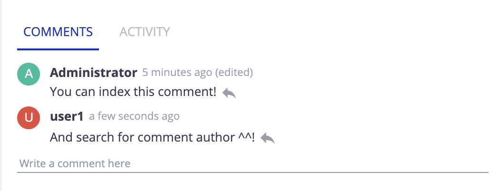</a> | Comment Indexing | Nuxeo
<a href="https://github.com/nuxeo/nuxeo-studio-community-cookbook/tree/master/modules/nuxeo/send-email-from-webui"></a> | Send emails from Nuxeo Web UI | Nuxeo
<a href="https://github.com/nuxeo/nuxeo-studio-community-cookbook/blob/master/modules/nuxeo/actions-versioned-documents">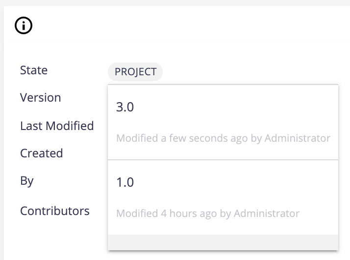</a> | Delete and Update Document Lifecycle state of versioned documents | Nuxeo
<a href="https://github.com/nuxeo/nuxeo-studio-community-cookbook/blob/master/modules/nuxeo/convert-date-to-timestamp"></a> | Convert date to timestamp | Nuxeo
<a href="https://github.com/nuxeo/nuxeo-studio-community-cookbook/blob/master/modules/nuxeo/related-documents"></a> | Display Document Relations | Nuxeo
<a href="https://github.com/nuxeo/nuxeo-studio-community-cookbook/blob/master/modules/nuxeo/delete-all-trashed-documents"></a> | Permanently delete all trashed documents | Nuxeo
<a href="https://github.com/nuxeo/nuxeo-studio-community-cookbook/blob/master/modules/nuxeo/automation-script-utils"></a> | Automation Script Utilities | Nuxeo

### Templates

Module | Description | Contributor
--- | --- | ---
<a href="https://github.com/nuxeo/nuxeo-studio-community-cookbook/tree/master/modules/nuxeo/send-email-from-webui"></a> | Send emails from Nuxeo Web UI | Nuxeo
<a href="https://github.com/nuxeo/nuxeo-studio-community-cookbook/blob/master/modules/nuxeo/email-templates-nuxeo"></a> | Email templates | Nuxeo
<a href="https://github.com/nuxeo/nuxeo-studio-community-cookbook/tree/master/modules/nuxeo/create-from-template"></a> | Document templates | Nuxeo

### Integrations

Module | Description | Contributor
--- | --- | ---
<a href="https://github.com/nuxeo/nuxeo-studio-community-cookbook/blob/master/modules/nuxeo/salesforce-ui"></a> | Display Salesforce metadata | Nuxeo

## Getting Started

There is nothing to build. Each module generally contains:

- XML extension, page providers, automation chain or automation scripting into Nuxeo Studio Modeler.
- Layouts, contributions within the Nuxeo bundle file,  HTML resources, medias that should be created in Nuxeo Studio Designer.

You can clone the repository locally:

```
git clone https://github.com/nuxeo/nuxeo-studio-community-cookbook.git
```

### Prerequisites

A **Nuxeo Studio Account** as well as an **active Nuxeo Studio Project** is needed. You can create an account from our [registration page](https://connect.nuxeo.com/register/#/) and benefit from a free 30-day trial to get access to:

- Nuxeo Studio, the web-based configuration and customization environment
- Nuxeo Marketplace, the application store with ready-to-install plugins and packages

## Repository Structuration

Each new module should be created in a specific folder:

- `/modules/nuxeo`: Contributions from the Nuxeo Team, for demos, PoC or tests.
- `/modules/partners`: Contributions from the Nuxeo Partner Ecosystem.
- `/modules/community`: Contributions from the Nuxeo Community.

## Contributing

You have to follow the repository contribution [guidelines](toolkit-and-guidelines) when submitting a new addon:

- If you're a partner, create your partner folder under `/modules/partners/` if it doesn't exist already. Then, create the readme file to present your company and your contributions. We provide a [README-PARTNER.MD template](https://github.com/nuxeo/nuxeo-studio-community-cookbook/blob/master/toolkit-and-guidelines/README-PARTNER.md).
- Create a README file to present your module, using the [README-MODULE.MD template](https://github.com/nuxeo/nuxeo-studio-community-cookbook/blob/master/toolkit-and-guidelines/README-MODULE.md).
- Create a `/modeler` and `/designer` folders to upload respectively resources from Nuxeo Studio Modeler and Nuxeo Studio Designer.
- Upload your resources.
- Push your changes
  - If you're from Nuxeo, reference your addon in this page.
  - If not, you won't be allowed to push directly to master. Your pull request will be then checked by the Nuxeo Team before being published.
- Et voilà! :wink:

## Support

:warning: **These features are not part of the Nuxeo Production platform.**

These solutions are provided for inspiration and we encourage customers to use them as code samples and learning resources.

This is a moving project (no API maintenance, no deprecation process, etc.) If any of these solutions are found to be useful for the Nuxeo Platform in general, they will be integrated directly into platform, not maintained here.

## Nuxeo Labs

You can access complete Nuxeo Marketplace addons on [Nuxeo Marketplace - Nuxeo Labs](https://connect.nuxeo.com/nuxeo/site/marketplace/category/nuxeo-labs) category (done for PoC and test purposes)

## Learn

- [Nuxeo Documentation](https://doc.nuxeo.com)
- [Nuxeo University](https://university.nuxeo.com)

## Licensing

[Apache License, Version 2.0](http://www.apache.org/licenses/LICENSE-2.0)

## About Nuxeo

[Nuxeo](www.nuxeo.com), developer of the leading Content Services Platform, is reinventing enterprise content management (ECM) and digital asset management (DAM). Nuxeo is fundamentally changing how people work with data and content to realize new value from digital information. Its cloud-native platform has been deployed by large enterprises, mid-sized businesses and government agencies worldwide. Customers like Verizon, Electronic Arts, ABN Amro, and the Department of Defense have used Nuxeo's technology to transform the way they do business. Founded in 2008, the company is based in New York with offices across the United States, Europe, and Asia.

Learn more at www.nuxeo.com.
