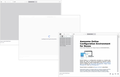
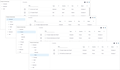
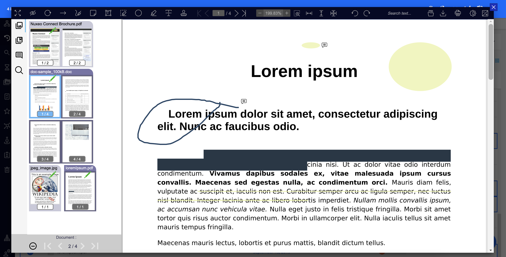
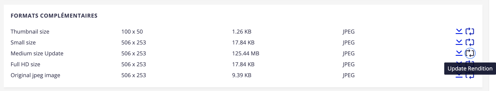
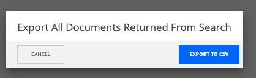
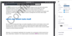
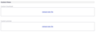
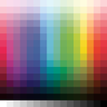
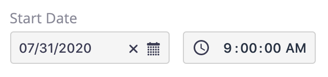
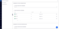

# About Nuxeo Studio Community Cookbook

This repository contains examples to help the Nuxeo Community enrich Nuxeo Studio projects. It provides various features and visual elements ready to be copy-pasted. Examples are included for Studio Modeler as well as Studio Designer.

# Repository Organization

* [modules/nuxeo](modules/nuxeo): Contributions from the Hyland Nuxeo Team.
* [modules/partners](modules/partners): Contributions from the Hyland Nuxeo Partner ecosystem.
* [toolkit-and-guidelines](toolkit-and-guidelines): these are template files for adding a new module.

# Prerequisites

A **Nuxeo Studio Account** as well as an **active Nuxeo Studio Project** are needed. You can create an account from our [registration page](https://connect.nuxeo.com/register/#/) and benefit from a free 30-day trial to get access to:

* Nuxeo Studio, the web-based configuration and customization environment
* Nuxeo Marketplace, the application store with ready-to-install plugins and packages

# Getting Started

There is nothing to build. Each module may contain:

* XML extension, page providers, automation chain or automation scripting into Nuxeo Studio Modeler.
* Layouts, contributions within the Nuxeo bundle file,  HTML resources, medias that should be created in Nuxeo Studio Designer.

These items are for copy/paste into Nuxeo Studio.

# Module listing

* [Latest Modules](#latest-modules)
* [Tips and Tricks](#tips-and-tricks)
* [Layouts](#layouts)
* [DAM](#dam)
* [AI](#ai)
* [Security / Authentication / User and Group Management](#security--authentication--user-and-group-management)
* [Reporting](#reporting)
* [Business Logics](#business-logics)
* [Templates](#templates)
* [Integrations](#integrations)

:information_source: Tip: you can click the thumbnail to view the module.

## Latest Modules

<table style="width:100%">
  <tr style="font-weight:bold">
    <th>Module</th>
    <th>Description</th>
    <th>Author</th>
    <th>Category</th>
  </tr>
  <tr>
    <td></td>
    <td>Document Viewer with "Loading..." Message</td>
    <td>Nuxeo</td>
    <td>Layout</td>
  </tr>
  <tr>
    <td></td>
    <td>Carousel</td>
    <td>Nuxeo</td>
    <td>Layout</td>
  </tr>
  <tr>
    <td></td>
    <td>Virtual Navigation</td>
    <td>Nuxeo</td>
    <td>Layout</td>
  </tr>
  <tr>
    <td></td>
    <td>Nuxeo Enhanced Viewer with Custom Field</td>
    <td>Nuxeo</td>
    <td>Layout</td>
  </tr>
  <tr>
    <td></td>
    <td>Replace Renditions</td>
    <td>Nuxeo</td>
    <td>Layout</td>
  </tr>
  <tr>
    <td></td>
    <td>Select All Documents and Send to Bulk Action from Search</td>
    <td>Nuxeo</td>
    <td>Layout</td>
  </tr>
  <tr>
    <td></td>
    <td>Nuxeo Enhanced Viewer Document Preview</td>
    <td>Genus</td>
    <td>Layout</td>
  </tr>
</table>

## Tips and Tricks

<table width="100%">
  <tr style="font-weight:bold">
    <th>Module</th>
    <th>Description</th>
    <th>Author</th>
  </tr>
  <tr>
    <td></td>
    <td>Tips and tricks to implement backend logics with Studio Modeler</td>
    <td>Nuxeo</td>
  </tr>
  <tr>
    <td></td>
    <td>Tips and tricks to design elements within Studio Designer</td>
    <td>Nuxeo</td>
  </tr>
  <tr>
    <td></td>
    <td>Automation Script Utilities</td>
    <td>Nuxeo</td>
  </tr>
</table>

## Layouts

Module | Description | Contributor
--- | --- | ---
 | Carousel | Nuxeo
 | Virtual Navigation | Nuxeo
 | Document Viewer with "Loading" Message | Nuxeo
 | Search for Documents via their Parent Containers | Nuxeo
 | Nuxeo Enhanced Viewer with Custom Field | Nuxeo
 | Replace Renditions | Nuxeo
 | Select All Documents and Send to Bulk Action from Search | Nuxeo
 | Nuxeo Enhanced Viewer Document Preview | Genus
 | Document Load and Preview | Nuxeo
 | Interactive PDF Search | Nuxeo
 | Custom Preview and Thumbnail | Nuxeo
 | Similar Color Search | Nuxeo
 | Copy or move documents without the clipboard | Nuxeo
 | Date Time Picker | Nuxeo
 | Geodistance Search + Google Map | Nuxeo
 | Display a field with Currency format | Nuxeo
 | Create a QR Code | Nuxeo
 | Cascading Fields in Document Layouts | Nuxeo
 | Highlight in Custom Searches | Nuxeo
 | Display EML Preview | Nuxeo
 | Add a progress bar | Nuxeo
 | Inject HTML into a page using bound data | Nuxeo
 | Custom Nuxeo Suggestion Display | Nuxeo
 | Collapsible Element | Nuxeo
 | Inline card property Editing | Nuxeo
 | Display Salesforce metadata | Nuxeo
 | Show/hide the value of a secret field | Nuxeo
 | Display Document Relations | Nuxeo
 | Display text using barcode font | Nuxeo
 | Geodistance Search + Google Map | Nuxeo
 | Preview related documents | Nuxeo
 | Replace Picture and Video Renditions | Nuxeo

## DAM

Module | Description | Contributor
--- | --- | ---
 | Similar Color Search | Nuxeo
 | Sets the video poster and search thumbnail | Nuxeo
 | Additional video conversions | Nuxeo

## AI

Module | Description | Contributor
--- | --- | ---
 | Similar Color Search | Nuxeo
 | Extract text from an image-based PDF with Google Vision | Nuxeo
 | Display sensitive data details contained in a document | Nuxeo

## Security / Authentication / User and Group Management

Module | Description | Contributor
--- | --- | ---
 | Local Group Administrators | Nuxeo
 | Bulk Workflow Reassignment | Nuxeo
 | Map SAML user attributes to Nuxeo | Nuxeo
 | Display sensitive data details contained in a document | Nuxeo
 | Show/hide the value of a secret field | Nuxeo

## Reporting

Module | Description | Contributor
--- | --- | ---
 | Monitor workflow instances status | Nuxeo
 | Display Kibana dashboards in the "Analytics" menu | Nuxeo
 | Generic Web UI Analytic Dashboards | Nuxeo

## Business Logics

Module | Description | Contributor
--- | --- | ---
 | Nuxeo Operation Button with Navigation | Nuxeo
 | Comment Indexing (:warning: only LTS2019) | Nuxeo
 | Send emails from Nuxeo Web UI | Nuxeo
 | Delete and Update Document Lifecycle state of versioned documents | Nuxeo
 | Convert date to timestamp | Nuxeo
 | Display Document Relations | Nuxeo
 | Permanently delete all trashed documents | Nuxeo
 | Automation Script Utilities | Nuxeo

## Templates

Module | Description | Contributor
--- | --- | ---
 | Send emails from Nuxeo Web UI | Nuxeo
 | Email templates | Nuxeo
 | Document templates | Nuxeo

## Integrations

Module | Description | Contributor
--- | --- | ---
 | Display Salesforce metadata | Nuxeo

# Contributing

You have to follow the repository contribution [guidelines](toolkit-and-guidelines) when submitting a new addon:

* If you're a partner, create your partner folder under `/modules/partners/` if it doesn't exist already. Then, create the readme file to present your company and your contributions. We provide a [README-PARTNER.MD template](https://github.com/nuxeo/nuxeo-studio-community-cookbook/blob/master/toolkit-and-guidelines/README-PARTNER.md).
* Create a README file to present your module, using the [README-MODULE.MD template](https://github.com/nuxeo/nuxeo-studio-community-cookbook/blob/master/toolkit-and-guidelines/README-MODULE.md).
* Create a `/modeler` and `/designer` folders to upload respectively resources from Nuxeo Studio Modeler and Nuxeo Studio Designer.
* Upload your resources.
* Push your changes
* Et voilà! :wink:

# Learn

* [Nuxeo Documentation](https://doc.nuxeo.com)
* [Nuxeo Training](https://university.hyland.com/pages/nuxeo)

# Support

**These features are not part of the Nuxeo Production platform.**

These solutions are provided for inspiration and we encourage customers to use them as code samples and learning resources.

This is a moving project (no API maintenance, no deprecation process, etc.) If any of these solutions are found to be useful for the Nuxeo Platform in general, they will be integrated directly into platform, not maintained here.

# License

[Apache License, Version 2.0](http://www.apache.org/licenses/LICENSE-2.0.html)

# About Nuxeo

Nuxeo Platform is an open source Content Services platform, written in Java. Data can be stored in both SQL & NoSQL databases.

The development of the Nuxeo Platform is mostly done by Nuxeo employees with an open development model.

The source code, documentation, roadmap, issue tracker, testing, benchmarks are all public.

Typically, Nuxeo users build different types of information management solutions for [document management](https://www.nuxeo.com/solutions/document-management/), [case management](https://www.nuxeo.com/solutions/case-management/), and [digital asset management](https://www.nuxeo.com/solutions/dam-digital-asset-management/), use cases. It uses schema-flexible metadata & content models that allows content to be repurposed to fulfill future use cases.

More information is available at [www.nuxeo.com](https://www.nuxeo.com).
