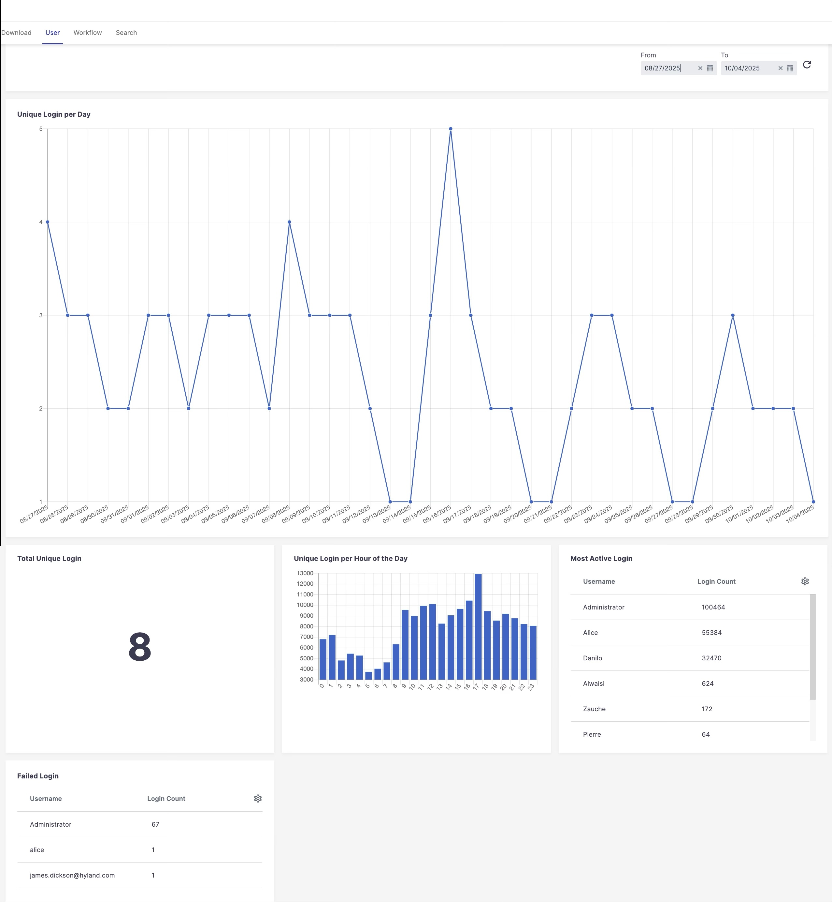

# Analytics and KPIs Examples

This module shows how to display custom analytics/KPIs, using mainly [Nuxeo Data Visualization](https://doc.nuxeo.com/nxdoc/data-visualization) tools.

For example, logins info:




## Usage

See also [Metrics](https://doc.nuxeo.com/nxdoc/metrics/) and [Audit](https://doc.nuxeo.com/nxdoc/audit/).

> [!NOTE]
> You can of course rename the components, put them in different places, etc.: Just adapt the misc. path and names in the code (rename everywhere, file name and everywhere it is used)

> [!NOTE]
> This is for inspiration: Look at the code and adapt to your exact needs.

In Nuxeo Studio Designer, "Ressources" tab:

1. Create a "cookbook-analytics" folder. Notice each example element (User and Doanload analytics) uses this name (see cookbook-user-analytics.html)
2. Inside this folder, import what is in the "designer" folder (create subfolders)
3. Import the examples
4. Add the following in the custom bundle of the plugin (import the elements, add entries to the Analytics item of the Admin. drawer.):

```html
<!-- Adapt the path if you changed locations and/or names -->
<link rel="import" href="cookbook-user-analytics.html">
<link rel="import" href="cookbook-download-analytics.html">

<nuxeo-slot-content name="cookbookUserAnalyticsItem" slot="ANALYTICS_ITEMS" order="11">
  <template>
    <nuxeo-page-item name="user" label="analytics.user"></nuxeo-page-item>
  </template>
</nuxeo-slot-content>
 
<nuxeo-slot-content name="cookbookUserAnalyticsPage" slot="ANALYTICS_PAGES" order="12">
  <template>
    <cookbook-user-analytics name="user"></cookbook-user-analytics>
  </template>
</nuxeo-slot-content>
 
<nuxeo-slot-content name="cookbookDownloadAnalyticsItem" slot="ANALYTICS_ITEMS" order="11">
  <template>
    <nuxeo-page-item name="download" label="analytics.download"></nuxeo-page-item>
  </template>
</nuxeo-slot-content>
 
<nuxeo-slot-content name="cookbookDownloadAnalyticsPage" slot="ANALYTICS_PAGES" order="10">
  <template>
    <cookbook-download-analytics name="download"></cookbook-download-analytics>
  </template>
</nuxeo-slot-content>
```

5. In the Translations part (UI tab of Designer), add an entry for the translation keys used in all elements. You also, of course, can hard code the values in each file. For example:

```JSON
{
  "analytics.download" : "Download",
  "analytics.download.top.downloader.heading" : "Top Downloader",
  "analytics.downloads.per.day" : "Asset Download per Day",
  "analytics.login.per.hour" : "Unique Login per Hour of the Day",
  "analytics.user" : "User",
  "analytics.user.most.login.failure.users" : "Failed Login",
  "analytics.user.most.login.nb" : "Login Count",
  "analytics.user.most.login.username" : "Username",
  "analytics.user.most.login.users" : "Most Active Login",
  "analytics.user.unique.per.day" : "Unique Login per Day",
  "analytics.user.unique.total" : "Total Unique Login",
  "label.duration.day" : "Day",
  "label.duration.day.plural" : "Days",
  "label.duration.hour" : "h",
  "label.duration.hour.plural" : "h",
  "label.duration.minute" : "m",
  "label.duration.minute.plural" : "m",
  "label.duration.month" : "Month",
  "label.duration.month.plural" : "Months",
  "label.duration.second" : "s",
  "label.duration.second.plural" : "s",
  "label.duration.year" : "Year",
  "label.duration.year.plural" : "Years"
}
```

## License
[Apache License, Version 2.0](http://www.apache.org/licenses/LICENSE-2.0.html)
