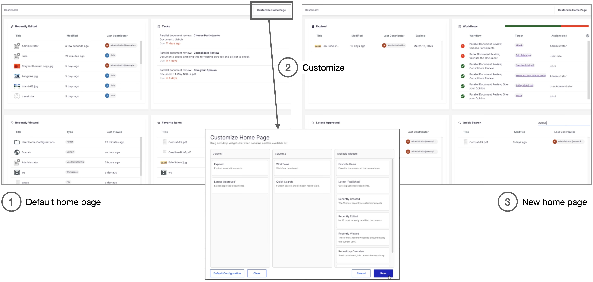
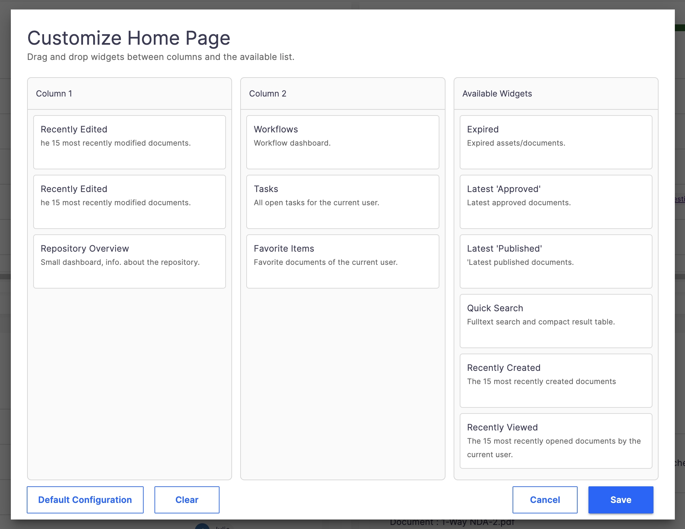

# Home Page Configuration

This module allows the user for configuring the widgets they want to display in their home page.

It can easily be tuned: modify the behavior of widgets, add new widgets, remove, etc.

## Prerequisites

Nuxeo Web UI

## Description

Once installed, users have a "Customize Home Page" button available at the top-right of the home page. From there, they can organize the available widgets in 2 columns, by drag and dropping:

By default, the module provides several widgets. They are made available depending on the user and their permission. For example, the "Repository Overview" is only for administrators (this can be changed, see below).

Once imported in your Studio project, you can of course (and you likely will) change some of them. For example, tune the search for the "Recently Approved", or the search for the "Expired", etc.

## How Does it Work?

> [!IMPORTANT]
> Since first release of this module, on March 2026, Nuxeo LTS 2025.16 (and soon, backported to LTS 2023) brings a new cool feature. A new REST API endpoint to handle user preferences (see [New Nuxeo User Preferences Modules](https://doc.nuxeo.com/nxdoc/nuxeo-server-release-notes/#introduce-new-nuxeo-user-preferences-modules).
> So, it is very likely that we will rewrite the storage part of the preferences, since it will be way easier: No need for a dedicated document type, no need to fetch or create this document, to handle permissions, etc.

1. **Saving the Configuration**

When a user saves a configuration, the `HomePageConfiguration_SaveUserConfig` Automation Script is run, and it saves the user configuration in a `UserHomeConfig` document (see below). Such a document is created only if a user explicitly saves a new configuration. As long a s user does not save a new configuration, the default configuration applies. This is done to avoid creating thousands of documents, one every time a user just logs in and has no (not yet) configuration available.

You will see in `HomePageConfiguration_SaveUserConfig`, the `UserHomeConfig` are stored at Root level, in a `Folder` named "User Home Configurations".

> [!TIP]
> The "User Home Configurations" Folder is created the first time the script is called and there is no existing `UserHomeConfig`.
> 
> To avoid multi-thread/concurrent users creating the folder at the same time, with the risk of creating duplicates, we strongly recommend to first create the folder, manually, as an administrator, as Root level. Once created, just block the permission inheritance, so only administrators can access it.

1. **Displaying the Widgets**

`nuxeo-home-page-layout` is the element displaying the widgets:

1. It loads the user configuration
2. Then displays the widgets in their columns

Displaying thae widget is done by `nuxeo-home-host`, which dynamically creates the element. This requires all possible widgets to be explicitely imported (in `nuxeo-home-host`) with the corresponding `<link ...`.

> [!WARNING]
> When you add a new widget, or want to remove a widget you don't use in your projects, think about updating both `nuxeo-home-host.html` and the `HomePageConfig_GetAvailableWidgets` Automation Script.

## Installation

> [!NOTE]
> As there are ~30 files and some folders to create, using the GitHub access for your Studio project will save you some time. See:
> 
> * [Studio Direct Git Access](https://doc.nuxeo.com/studio/direct-git-access/)
> * and [HOWTO: Develop Faster with Git and Your Nuxeo Studio Project](https://doc.nuxeo.com/studio/how-to-work-with-git-and-studio-project/)

> [!TIP]
> You can, of course, rename any elements in this module, to fit your naming convention or the way you organize files. Just make sure to rename them everywhere. For example:
> 
> * if you change the name of `HomePageConfig_GetAvailableWidgets` JS automation, think about changing it everywhere it is used (Designer and Modeler, if called in another script).
> * If you change the name(s), the structure and/or the location of the files, also update all the `link rel="import" href="...`

### Studio Designer

#### Import the elements and their structure

* In Nuxeo Studio Designer > Resources, import everything (folder included) that you can find at Designer > In-Resources
  * Keep the organization and names, or change the `<Link...`>
* It is important that `nuxeo-home.html` is at the root of the UI folder, so don't move/rename this one.

#### Merge (or import) the translations

The module is localized and uses translation keys. It provides the json localization files in EN and FR. See [Merge-with-translations](designer/Merge-with-translations)

* If you don't already have a translation file, just import these.
* If you have one, _merge_ the content of the files from the module (This means do not just select all > copy > paste, or you'll have extra `{` and `}` that will cause serious deployment issues. Instead, just copy the content inside the curly brackets, and paste it in your messages-....json file(s)

### Studio Modeler

#### Data Model

Create a new document type, `UserHomeConfig` with 2 fields:

* `configJson`, string
* `user`, type User/Group
* You can find some suggestion for icons in modeler > UserHomeConfig Icons (but of course, feel free to use any other you prefer)

#### Automation Script

* Create all the AutomationScript you can find in the [modeler](modeler) folder.
* Again, if you rename a chain, rename it everywhere

## Tuning the module once installed (or before installation/import)

### Tune the list of widgets available

Just update the `HomePageConfig_GetAvailableWidgets` Automation Script accordingly. You can tune depending on the fact the user belongs to a certain group, or a list of groups, etc.

For example, you could have a "Recently Opened Legal Cases" widget available only for users of the "CaseInvestigators" and the "Legal" group. 

### Remove widgets you don't use

If you don't want some of these widgets:

* Delete their file in their enclosing folder
* Update the `HomePageConfig_GetAvailableWidgets` Automation Script, to return only the available widgets depending on the user.
* Update `nuxeo-home-host.html` and remove the corresponding `<link ...`

### Tune one widget behavior

This is one of the main reasons why this module is in the Nuxeo Studio Community Cookbook: It can be easily tuned since you have all the source. So, to tune a widget behavior, just look at its HTML/JS and tune it. For example, the `nuxeo-home-expired` widgets listed the widgets whose `dc:expired` field is lower than "now." You may want, instead, to:

* Get documents expired only during the last month
* Or testing only `dc:expired` is not enough, you also to test other fields
* Or ...

Just open nuxeo-home-expire.html find the `_getExpiredNxql` function, and tune it accordingly.

The same goes for all the provided widgets

### Add a new widget

The [NewWidgetExample.html](designer//Users/thibaud.arguillere/GitHub/nuxeo-sandbox/nuxeo-studio-community-cookbook/modules/nuxeo/Home Page Configuration/designer/In-Resources/nuxeo-home/nuxeo-home-widgets/NewWidgetExample.html) explains the main principles: Required `link..`, required `visible`, ...

Do not forget to also:

* Add it to the `HomePageConfig_GetAvailableWidgets` Automation Script.
* And add it to `nuxeo-home-host.html` with the corresponding `<link ...`

### Change the default configuration

The default configuration is applied when the users never set up a new configuration. It displays the same elements as the default nuxeo-home:

* Column 1: _Recently Edited_ and _Recently Viewed_
* Column 2: _Tasks_ and _Favorites_

If you want to change the default configuration, there are 2 places for this:

* The `HomePageConfig_GetAvailableWidgets` Automation Script.
* And the `nuxeo-home-config-behavior.html` file
