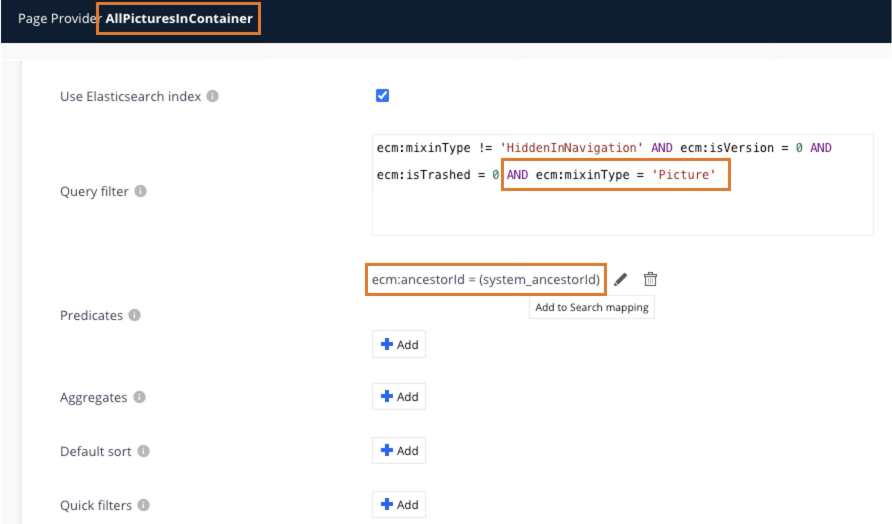

## Display All Pictures in a Container (in the whole hierarchy)

This carousel tab displays all the documents with a `"Picture"` facet in the whole hierarchiy of the container (children, grand-children, etc.)

1. Create Page Provider (in our example, `AllPicturesInContainer`). Set it like in this screenshot (make sure to use `ecm:ancestorId`, not `ecm:parentId`)

2. In Designer, import `nuxeo-carousel-pictures-in-container.html``
3. In Designer, create a new Tab, for Page.
  * In "Element Binding", use `nuxeo-carousel-pictures-in-container`
  * Set the `document` atribute to `[[document]]`
  * If you want, change the `page-size`
  * Add a filter, typically `One of the facets" => `Folderish`
    * Warning; this will display the tab for all and every Folderish
    * Tune with other filters if needed
