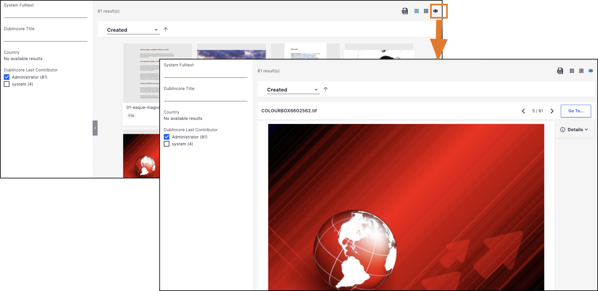
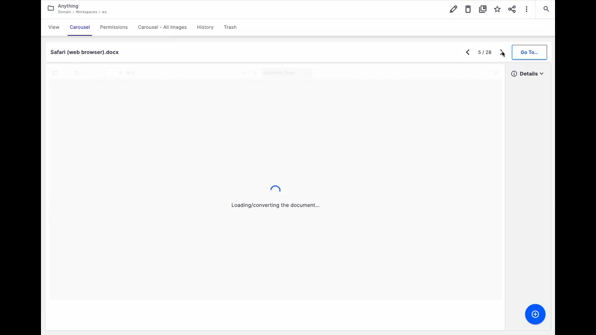

# Carousel

The `nuxeo-carousel-display` element displays a carousel of documents, loaded from a PageProvider, with previous, next and Go To buttons:


Data comes from a page provider, and the carousel handles the fetching of more data when needed. For example, typically, the `pageSize` of a page provider is 40. When the user is on document #39 and clicks the "Next" button, the element increments the page index and calls the page provider for next page.

## Prerequisites

- Nuxeo Web UI
- The `nuxeo-se-document-viewer`element, available [here](https://github.com/nuxeo/nuxeo-studio-community-cookbook/tree/master/modules/nuxeo/document-viewer-with-loading-message)

## Usage

In Nuxeo Designer:

* If not done yet, import the `nuxeo-se-document-viewer` element, available [here](https://github.com/nuxeo/nuxeo-studio-community-cookbook/tree/master/modules/nuxeo/document-viewer-with-loading-message)
* Import `nuxeo-carousel-display.html`, found [here](designer/nuxeo-carousel-display.html).

In `nuxeo-carousel-display.html`, check the import of `nuxeo-se-document-viewer` is OK (check the link is correct for accessing `nuxeo-se-document-viewer`)

Once imported and updated for `nuxeo-se-document-viewer`, the element can be used standalone or inside a `nuxeo-results`.

### Standalone Usage, with its own nuxeo-page-provider

(see the [Examples](Examples) folder):

```html
<nuxeo-carousel-display
  id="carouselDisplay"
  page-provider="myPageProvider"
  params="[[params]]">
</nuxeo-carousel-display>
```

When standalone, and _if_ using a parent document (see below the examples to display the content of the current Folderish), the element exposes the `parentDocumentChanged(document)` API, to be called _by the parent_ when the parent document changes. The parent element may also have changed the params, based on the new main document (see the examples.)

### Inside a nuxeo-results

You can manually add the carousel inside a nuxeo-results:



Following nuxeo-results pattern, you just add `nuxeo-carousel-display` with the _required_ attributes:

* `class="results"`,
* `name`,
* and an `icon`

```html

<nuxeo-results . . .>

  . . . data-grid, data-table, ...

  <nuxeo-carousel-display
    name="carousel"
    icon="icons:view-carousel"
    class="results"
    page-provider="[[nxProvider]]">
  </nuxeo-carousel-display>
  . . .
```

> [!IMPORTANT]
> * You don't set `params`, this is done by the caller.
> * The expression `[[nxProvider]]` is the *required* value to use in the context of a `nuxeo-results`, do not change it


### Common Settings (standalone or inside a `nuxeo-results`)
  
* In all cases, you can also pass the `schemas` property. It is set by default to "*", so all schemas are fetched. You can restrict that to only the schemas you need to display in the metadata layout of your documents, for example:

```html
<nuxeo-carousel-display
  page-provider="myPageprovider"
  schemas="dublincore,common,uid,file,product,company">
</nuxeo-carousel-display>
```

* Also, the element fetches documents when it is time to render them (hence why you don't need to pass enrichers, the element chooses them internally).

### Other Info

* Navigation with arrow keys is done by giving the focus to the whole carousel container (then handling keydown events).
* Translation keys are handled with default EN values. Keys are:
  * `carousel.button.goTo`: "Go to…" (Button label)
  * `carousel.prompt.goTo`:
    * `Default is "Go to position (1..<VALUE>):"
    * If your label has "<VALUE>", it will be replaced by the total number of entries.
  * `carousel.converting`: "Converting to PDF..." (Loading message)
* When a document takes time to be converted to PDF before being displayed in the viewer (typically a heavy Word or Excel document), a "loading status" is dipslayed, so the user does not wait in front of a gray screen:




## Examples

In the "Example" folder, you can find examples of usage of `nuxeo-carousel-display`:

* `nuxeo-carousel-document-content.html` reuses the default `advanced_document_content` page provider to display the content (first level) of the current Folderish document
* `nuxeo-carousel-pictures-in-container` uses a custom page provider to dsplay all the documents with `Picture` facet inside a `Folderish`, including the whole hierarchy (folders, sub-folders, sub-sub-folders, etc.)

In both case:

0. (for `nuxeo-carousel-pictures-in-container`, create the page provider)
1. Import the elements in Designer
2. Create tab using the element(s), setup the correct filters, possibly tune the schema(s) fetched 

## Room for Improvment

Yes, there is room for improvment. This is an example. A bit complex, with hundreds of lines of HTML/JS.

We could extract some parts as behaviors, even some elements (maybe a nuxeo-document-viewer-with-loading-indicator), etc.

Anyone welcome to contribute :-)


