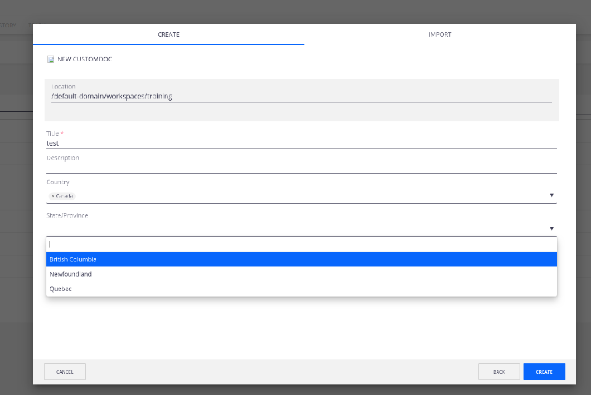

# Cascading Fields



## Prerequisites

- Nuxeo Web UI installed

## Description

This tutorial helps you configure cascading fields in an editable document layout

## Usage

Show/Hide fields based on user input

## Installation

### Studio Modeler

- For the basis of an example, please have the following custom doctype configured: `CustomDoc`
- For the basis of an example, please have the following fields configured: `customdoc:country`, `customdoc:state_province`
- For the basis of an example, please have the following vocabularies configured: `custom_countries`, `usa`, `canada`. Values for `custom_countries`: USA (usa); Canada (canada). Values for `usa`: Massachusetts (massachusetts) ; New York (new-york); California (california). Values for `canada`: Quebec (quebec); British Columbia (bc); Newfoundland (newfoundland). `customdoc:country` field should point to the country vocab. `customdoc:state_province` field can point to either vocab (usa or canada), the directory will be dynamically set in the layouts eventually...

### Studio Designer

- Generate layouts using Designer for the `CustomDoc`. `customdoc:country` and `customdoc:state` will be added to the layouts. The idea is to only show the state field once a country has been selected, and the values of the state field will depend on what has been selected for the country.

- Update the country field to what is below
```    
<nuxeo-directory-suggestion id="country" role="widget" value="{{document.properties.customdoc:country}}" label="Country" directory-name="custom_countries" min-chars="0" on-value-changed="_calculateState"></nuxeo-directory-suggestion>
```

- Then, update state field to what is below

```
 <nuxeo-directory-suggestion id="state" value="{{document.properties.customdoc:state_province}}" label="State/Province" role="widget" min-chars="0" hidden min-chars="0"></nuxeo-directory-suggestion>
```

- Add the following function to Polymer

```
      _calculateState: function(e) {
        var selection = e.detail.value;
        this.$.state.setAttribute("directory-name", selection);
        this.$.state.removeAttribute("hidden");
    },
```
