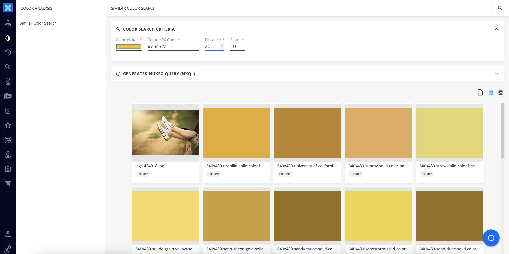
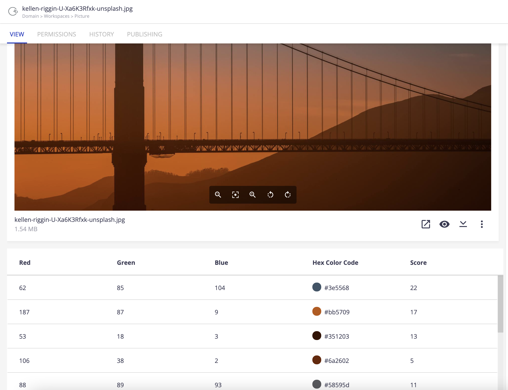

# Similar Color Search




## Prerequisites

- Nuxeo Web UI
- Nuxeo Vision with Google Vision API, or any other integration providing dominant color extraction with the following information: RGB value, HEX value, score

## Description

This contribution provide an easy way to perform similar color search. When pictures are imported in Nuxeo Platform, a dominant color extraction is performed thanks to Nuxeo Vision and Google Vision API, and stored in the document properties. A script calculated the [HSL](http://thenewcode.com/61/An-Easy-Guide-To-HSL-Color) value of each color: comparing colors with the RGB values is irrelevant as two close colors can have a very different RGB and HEX code. HSL system is more human-friendly since this is how we perceive colours actually. 

The search automatically the HEX code generated by the color picker to HSL values. The similarity is calculated with the distance entered by the user: it allows us to provide range of values to search for the H, S and L value:
- All colors with H value > H - distance AND H value < H + distance AND L value > L - distance AND L value < L + distance AND S value > S - distance AND S value < S + distance
In addition, we filter by the color dominance

## Usage

A new color search menu is created in the left sidebar. The user has to select:
- The HEX code thought either by selecting a color in the color picker element or by entering manually the HEX value
- The distance corresponding to the level of similarity with the target color 
- The score is the level of color dominance in the picture

Once the search criteria are selected, the autogenerated NXQL query is executed: the user can unfold the corresponding card to visualize it.

The results are automatically refreshed when any value is modified.

## Installation

### Studio Modeler

- Create the `AS_NuxeoVision_Config` automation scripting (input and output are `Document`)
- Create the `XML_NuxeoVision` XML extension 
- Create the `ColorFacet` in SETTINGS > Registries > Document Facets

```json
{
  "facets": [
    {
      "id": "ColorFacet",
      "description": "Facet to get color analysis"
    }
  ]
}
```

- Create the `color_extraction` schema (and `color_extraction` as prefix)
  - Create a multi-valued complex property called `colors` with the following sub properties:
    - `blue` (integer)
    - `green` (integer)
    - `red` (integer)
    - `css` (string)
    - `pixelFraction` (floating point)
    - `score` (floating point)
    - `hsl_h` (integer)
    - `hsl_s` (integer)
    - `hsl_l` (integer)
 

### Studio Designer

- Copy all the elements contained in the `designer` folder (right under `UI`)
- Add the `<color-info-view document="[[document]]" role="widget"></color-info-view>` element in the document type layout with color extraction
- Add the following lines in your custom bundle file:

```
<link rel="import" href="color-search/cookbook-color-search.html">
<link rel="import" href="color-search/cookbook-color-search-drawer.html">

<nuxeo-slot-content name="colorSearch" slot="DRAWER_ITEMS" order="11">
  <template>
    <nuxeo-menu-icon label="Color Search" name="color-search" icon="icons:invert-colors" route="page:cookbook-color-search"></nuxeo-menu-icon>
  </template>
</nuxeo-slot-content>
<nuxeo-slot-content name="colorSearchDrawer" slot="DRAWER_PAGES">
  <template>
    <cookbook-color-search-drawer name="color-search"></cookbook-color-search-drawer>
  </template>
</nuxeo-slot-content>
<nuxeo-slot-content name="colorSearchPage" slot="PAGES">
  <template>
    <cookbook-color-search name="cookbook-color-search"></cookbook-color-search>
  </template>
</nuxeo-slot-content>
```

## Issues and Limitations

- The similar color search works with **correlated** values: be aware complex property correlations are not supported by ElasticSearch, so you must use the database as the backend for the query.
