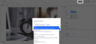

# New Copy / Move Document Actions



## Prerequisites

- Nuxeo Web UI installed

## Description

This contribution allows you to copy the current document in multiple folderish documents without using the clipboard. It also provides a "Move" operation to a single folder.

## Usage

Navigate to a document and click either on the Move or Copy button. A dialog will appear to select the target folder(s). In the case of a Move, you're redirected to the new parent folder.

## Installation

### Studio Modeler

- Copy / paste the `AS_Copy` and `AS_Move` **automation scripting**.
  - Input and output should be `Document`
  - Create `targetfolders` as parameter for the `AS_Copy` automation scripting and `targetfolder` for `AS_Move`.
- Create a **page provider** called `PP_Target_Folder`
  - Query filter: `ecm:mixinType != 'HiddenInNavigation' AND ecm:isVersion = 0 AND ecm:isTrashed = 0 AND ecm:fulltext = '?*' AND ecm:mixinType IN ('Folderish')`
  - In **Advanced Configuration**, uncheck the **Quote parameter** property.

### Studio Designer

- Copy the content of the `designer` folder in **Resources > UI**. Remember you can create a dialog from the "Create" button in the "Resources" tab, and select the "Dialog Action template" element template
- Create a **Custom button** linked to the 2 elements. You should end up with the following similar contribution in your bundle file:

```
<link rel="import" href="custom-elements/copy-element.html">
<link rel="import" href="custom-elements/move-element.html">
<!-- Contribution of element 'copy-element' for slot 'DOCUMENT_ACTIONS' -->
<nuxeo-slot-content name="copyButton" slot="DOCUMENT_ACTIONS" order="1">
  <template>
    <nuxeo-filter document="[[document]]" type="File,Video,Picture">
      <template>
        <copy-element document="[[document]]" icon="nuxeo:copy" label="Copy"></copy-element>
      </template>
    </nuxeo-filter>
  </template>
</nuxeo-slot-content>
<!-- Contribution of element 'move-element' for slot 'DOCUMENT_ACTIONS' -->
<nuxeo-slot-content name="moveButton" slot="DOCUMENT_ACTIONS" order="2">
  <template>
    <move-element document="[[document]]" icon="icons:exit-to-app" label="Move"></move-element>
  </template>
</nuxeo-slot-content>
```

## Configuration

- Adapt the query to fetch specific target folder(s)
- Adjust the location and filters for the buttons
