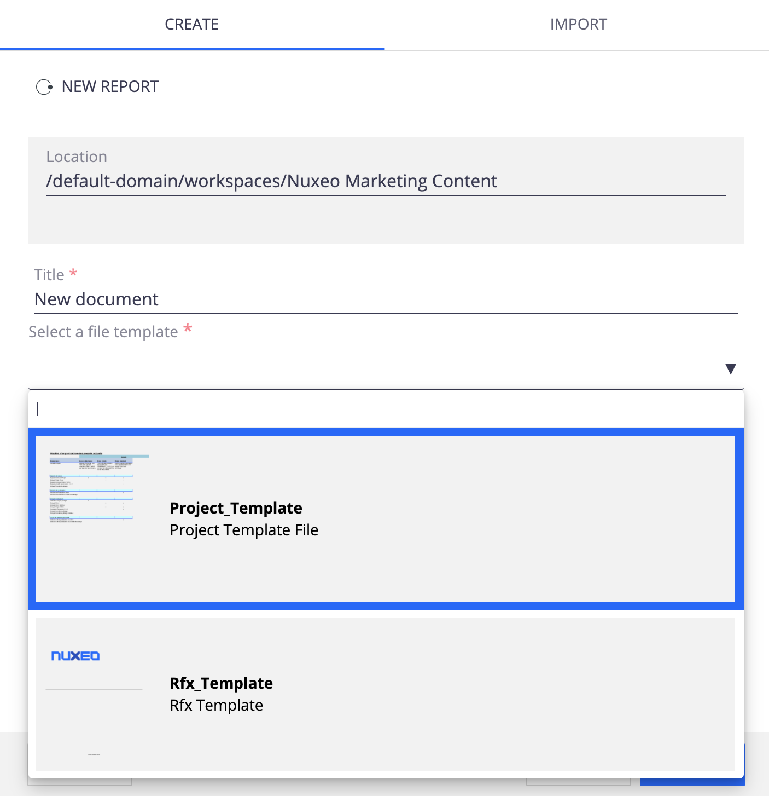

# Create a new document from a template list

## Prerequisites

- Install nuxeo-template-rendering addon.

## Description

Allow for any desired Document Type to create a new document based on the selection of file templates.
Template files are stored in the Template section in Nuxeo Platform.

When creating a new document, a list a file template is available for the user to select.
This behaviour is often requested in document management platform, when specific templates are available for users (usually Office Documents), in order for them to use the right company template and not start from a blank document.

## Usage

- Create a document type (or select an existing one) on which you want to use template files for creation.
- Add the schema `fileTemplate` to your document type
- Adapt the Event `EH_AS_CreateFromTemplate` to be executed on your document type.
- Integrate the following in the `create` layout of your document type.
    `<nuxeo-filter document="[[document]]" schema="fileTemplate">
      <template>
        <nuxeo-file-template-select-element document="[[document]]"></nuxeo-file-template-select-element>
      </template>
    </nuxeo-filter>`
- Add your file templates in the Root>Domain>Templates section in your Nuxeo Platform.

## Installation

All required files are available in the folders designer and modeler.

### Studio Modeler

- Create Schema : `fileTemplate` importing `fileTemplate.xsd`
- Create Automation Chain : `AC_SearchTemplates` (copy paste content from file `AC_SearchTemplates`)
- Create Automation Script : `AS_CreateFromTemplate` (copy paste content+instructions from file `AS_CreateFromTemplate.js`)
- Create Event Handler : `EH_AS_CreateFromTemplate` (follow instructions from file `EH_AS_CreateFromTemplate`)

### Studio Designer

- Copy Paste folder and files available in `designer>UI`.
- Add `<link rel="import" href="create-from-template/nuxeo-file-template-select-element.html">` in your custom bundle.

## Documentation

- [Template rendering](https://doc.nuxeo.com/nxdoc/template-rendering-addon/)
