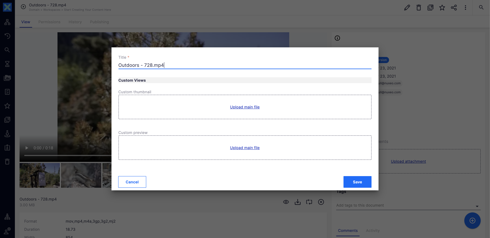

# Custom views (Previews and thumbnails)




## Prerequisites

- Nuxeo Web UI

## Description

In Nuxeo Platform, any kind of file can be imported: it happens that very specific file formats doesn't have a default converter, so there is no preview or thumbnail for the document. You can also need to set a specific preview or thumbnail for a video instead of the random picture extraction or when the preview quality/content is not satisfying: this contribution will solve these issues by providing an easy way to add and display a custom thumbnail and a custom preview. This contributions works when the main file is updated.

This cookbook is oriented for `File`, `Picture` and `Video` document type and subtypes. The mechanism would be the same for any other document types: just follow the logic described in the [Solution implementation details](#solution-implementation-details) section.

## Usage

Add a custom preview and thumbnail from the document edit layout.

## Solution implementation details

The contribution is composed of the following element:

- A custom **facet** which brings a schema to store the custom thumbnail file as well as the custom preview.
- The **facet should be attached to your document type**: you can do it in XML extension for the default document type or by importing the default Nuxeo Platform external template, or by simply adding the facet to your custom document type.
- In the case of the `Picture` and `Video` doctypes and subtypes, we register the **events triggered when the renditions are completed** so that we can associate our custom thumbnail once the main file is updated.
- We create a specific **converter** when the user uploads a new custom thumbnail so that it is not using a big resolution file for a thumbnails.
- We also need an **automation scripting** in charge of implementing the business logic. It basically generates the thumbnail and associate the custom thumbnail to the current document. 
- Two **event handlers** to apply the custom thumbnail: one when the user uploads a new custom thumbnail, and another one when the main file is updated and the new conversion generated so that the custom thumbnail is not lost. Both event handlers trigger the same automation chain: there is a filter in the automation chain to identify which event is triggering the automation chain.
- Two **block layouts** to be integrated in your document type layouts: one on edit mode, the other one in view mode.

:information_source: On the edit mode, we need to have 2 properties to update the thumbnail: 
- One on the thumbnail that will be applied for **all new versions of the document**
- One on the thumbnail **on the same version of the document**, aka live version. 
The file cannot be the same because the `Save` option has to be set to false in one case, and to true in another.

## Installation

The installation is following the logical order in which elements should be created.

### Studio Modeler

### Schema

Go to **CONFIGURATION** > **Content Model** > **Schemas** and create a schema called `custom_view` (with prefix `custom_view`), with the following properties:
- `preview` of type `blob` (resulting XPATH is `custom_view:preview`)
- `thumbnail` of type `blob` (resulting XPATH is `custom_view:thumbnail`)

### Facet

Go to **SETTINGS** > **Registries** > **Document Facets** and create the new facet
```
{
  "facets": [
    {
      "id": "CustomView",
      "description": "Facet to set manually a custom document thumbnail and document preview"
    }
  ]
}
```

### XML Extensions

Go to **CONFIGURATION** > **Advanced Settings** > **XML Extensions**

- Create an XML extension to link the new facet to the new schema
```
<extension point="doctype" target="org.nuxeo.ecm.core.schema.TypeService">
  <facet name="CustomView">
    <schema name="custom_view"/>
  </facet>
</extension>
```
- Create an XML Extension to add the new facet to the target document type. You can remove the `<doctype>` part for the document types which don't need a custom thumbnail or preview. In the case of a custom document type, just check the box of the facet in your document type definition screen.

```
<extension point="doctype" target="org.nuxeo.ecm.core.schema.TypeService">  
<!-- See https://explorer.nuxeo.com/nuxeo/site/distribution/Nuxeo%20Platform-2021/viewExtensionPoint/org.nuxeo.ecm.core.schema.TypeService--doctype -->

	<doctype extends="Document" name="Picture">
      <schema name="common"/>
      <schema name="uid"/>
      <schema name="dublincore"/>
      <facet name="Picture"/>
      <facet name="Versionable"/>
      <facet name="Publishable"/>
      <facet name="Commentable"/>
      <facet name="HasRelatedText"/>
      <facet name="NXTag"/>
      <!-- We add the new facet -->
  	  <facet name="CustomView"/>
	</doctype>

	<doctype extends="Document" name="File">
      <schema name="common"/>
      <schema name="file"/>
      <schema name="dublincore"/>
      <schema name="uid"/>
      <schema name="files"/>
      <facet name="Downloadable"/>
      <facet name="Versionable"/>
      <facet name="Publishable"/>
      <facet name="Commentable"/>
      <facet name="HasRelatedText"/>
      <!-- We add the new facet -->
      <facet name="CustomView"/>
      <!-- We add also a File facet to easily identify File subtypes -->
      <facet name="File"/>
    </doctype>
  
    <doctype extends="Document" name="Video">
      <schema name="common"/>
      <schema name="dublincore"/>
      <schema name="uid"/>
      <schema name="files"/>
      <facet name="Commentable"/>
      <facet name="Versionable"/>
      <facet name="Publishable"/>
      <facet name="Video"/>
      <facet name="HasStoryboard"/>
      <facet name="HasVideoPreview"/>
      <facet name="NXTag"/>
      <!-- We add the new facet -->
      <facet name="CustomView"/>
    </doctype>
  
</extension>
```

Finally, let's create a last extension to set the converter which will be used for custom thumbnails:

```
<extension target="org.nuxeo.ecm.platform.commandline.executor.service.CommandLineExecutorComponent" point="command">
  <command name="convertToJpg" enabled="true">
      <commandLine>convert</commandLine>
      <parameterString>#{sourceFilePath} -resize #{height}x#{width} -background white -flatten #{targetFilePath}</parameterString>
      <installationDirective>You need to install ImageMagick.</installationDirective>
  </command>
</extension>

<extension target="org.nuxeo.ecm.core.convert.service.ConversionServiceImpl" point="converter">
  <converter name="convertToJpg"
    class="org.nuxeo.ecm.platform.convert.plugins.CommandLineConverter">
    <sourceMimeType>image/jpeg</sourceMimeType>
    <sourceMimeType>image/png</sourceMimeType>
    <destinationMimeType>image/jpeg</destinationMimeType>
    <parameters>
      <parameter name="CommandLineName">convertToJpg</parameter>
    </parameters>
  </converter>
</extension>
```

### Core events

Go to **SETTINGS** > **Registries** > **Core events** and expose the events triggered when picture renditions are generated (`pictureViewsGenerationDone` for `Picture` doctype and subtypes) and when video renditions are generated (`videoConversionsDone`). There is no event for thumbnail generation for `File` type and subtypes.


```
{
  "events": {
    "pictureViewsGenerationDone": "Picture Views Generation Completed",
    "videoConversionsDone": "Video Conversions Done"
  }
}
```

### Automation scripting

Go to **CONFIGURATION** > **Automation** > **Automation scripting** and create the `AS_AddCustomView` automation scripting (check the `modeler` subfolder).

### Event handlers

Go to **CONFIGURATION** > **Automation** > **Event Handlers** and create two event handlers:

- `EH_AS_AddCustomView_AddNew` on the `Before document modification` event, on documents having the facet `CustomView`. It must be linked to the `javascript.AS_AddCustomView` automation scripting.
- `EH_AS_AddCustomView_ViewGenerated` on the `Picture Views Generation Completed` and `Video Conversions Done` events, set as `Asynchronous`, on documents having the facet `CustomView`. It must be linked to the same `javascript.AS_AddCustomView` automation scripting.

 
### Studio Designer

Go to **UI** > **Layout Blocks** and create two elements:
- `custom-preview-view` (content in the `designer` folder)
- `custom-view-edit` (content in the `designer` folder)
  
## Configuration

Add the `custom-view-edit` element in the `edit` layout of your document type and `custom-preview-view` element in the `view` layout of your document type (it should replace the default `nuxeo-document-viewer` element).

## Issues and Limitations

- As there is no event when thumbnails are updated for `File` document types, this cookbook cannot update the generated thumbnail with the custom one when a the main file is modified (even if the `custom_view:thumbnail` is kept). It would need to create a new Nuxeo listener, aka a Java class reacting to a list of events, and associate it to a core event.
