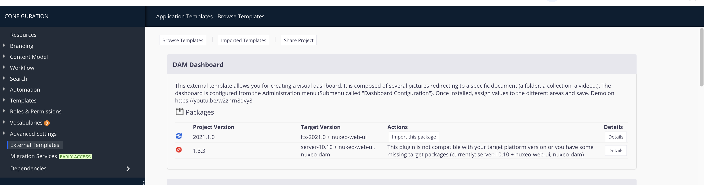

# Visual Dashboard with Pictures

> [!WARNING]
> This module was moved to an External Template.
> 
> In Nuxeo Studio, go to CONFIGURATION > External Templates and import the `DAM Dashboard`template. Notice that this template is not limited to DAM despite its name, it can be used with any kind of content application

