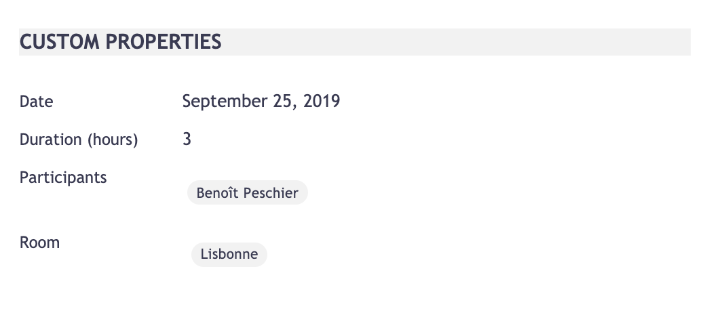

# Designer Tips and Tricks



## Table Of Content

- [Update the children document listing in the View tab of folderish documents](#update-the-children-document-listing-in-the-view-tab-of-folderish-documents)
- [Refresh current folder's listing after clicking an operation action that moves one of the child document](#refresh-current-folders-listing-after-clicking-an-operation-action-that-moves-one-of-the-child-document)
- [Suggestion formatters](#suggestion-formatters)
- [Create a table with two columns](#create-a-table-with-two-columns)
- [Position several Nuxeo elements in the same row](#position-several-nuxeo-elements-in-the-same-row)
- [Get property name and property value on the same row](#get-property-name-and-property-value-on-the-same-row-as-the-nuxeo-document-info-section)
- [Put a header](#put-a-header)
- [CSS properties to update when creating a new theme](#css-properties-to-update-when-creating-a-new-theme)
- [Update creation and edition screen size](#update-creation-and-edition-screen-size)
- [Set height to nuxeo-data-table](#set-height-to-nuxeo-data-table)
- [Update Nuxeo Favicon](#update-nuxeo-favicon)

## Prerequisites

- Web UI installed

## Description

This module helps you to tune the default element scaffolded by Studio Designer.  

## Usage

Switch to code on the layouts and elements in Studio Designer and adapt the code to your needs.

## Studio Designer Contributions

### Update the children document listing in the View tab of folderish documents.

Typically, if you need to update the default document listing on the "View" tab with properties from your custom document type.

1. Create a document type with a folderish facet, or inheriting from Workspace/Folder, and generate the view layout in Designer
2. Create a page provider, and add the `ecm:parentId` as predicate with the `=` operator. Then you can add also any additional predicates or aggregates you would need. Interesting for filtering columns as in the [nuxeo-document-content](https://github.com/nuxeo/nuxeo-web-ui/blob/10.10/elements/nuxeo-results/nuxeo-document-content.html#L201) element 
3. Edit the following attributes in the `nuxeo-page-provider` element inside your view element

- `provider="advanced_document_content"` by `provider="YOUR_PAGE_PROVIDER_ID"`
- `params="[[params]]"` by `params="[[_computeParams(document)]]`
- In `schemas`, add the schemas used by your aggregates and predicates

4. Adapt the column which needs to appear on your listing. :information_source: If you're using suggestion elements, remove the `label` attribute from the listing so that they are not doubled

5. Add the following section in the Polymer part, right after the `@doctype` annotation section. 
```
document: {
        type: Object,
      },
      params: {
        type: Object
      }},

    ready: function() {
      this.nxProvider = this.$.nxProvider; 
    },

    _computeParams: function (document) {
      return document ? {system_parentId: this.document.uid} : {};
    },
  });
  </script>
</dom-module>

```

### Refresh current folder's listing after clicking an operation action that moves one of the child document

Add this section to your custom action button function:

```
var op = this.$.op; <=== Assuming your nuxeo-operation element id is "op"
op.headers || (op.headers = {});
op.headers["nx_es_sync"] = true;
```
### Suggestion formatters

If you are not satisfied with the padding and margin of the suggestion elements, you can use the formatters instead:

- `[[formatDirectory(document.properties.XXX:XXX)]]` for vocabularies
- `[[formatVersion(XXX)]]` for versions

For multivalued properties, here is [an example](https://github.com/nuxeo/nuxeo-web-ui/blob/10.10/elements/nuxeo-results/nuxeo-document-content.html#L204)

The complete list is available [here](https://github.com/nuxeo/nuxeo-elements/blob/master/ui/nuxeo-format-behavior.js)


### Create a table with two columns

```
<div style="width:100%;margin-top: 10px;">
     <div style="float: left;width:50%;vertical-align: text-top;">
     <div style="float: right;width:50%;vertical-align: text-top;">
</div>
```

### Position several Nuxeo elements in the same row

```
<div class="layout horizontal flex">
  <nuxeo-element1/>
  <nuxeo-element2/>
  <nuxeo-element3/>
</div>
```

Without forgetting to update the `<style>` line with `<style include="iron-flex iron-flex-alignment">`

### Get property name and property value on the same row (as the nuxeo-document-info section)

1. Add in the `<style>` section:

```
<style>
      .properties label {
        min-width: 10em;
        overflow: hidden;
        text-overflow: ellipsis;
      }
      .item {
        @apply --layout-horizontal;
        @apply --layout-flex;
        line-height: 2.2rem;
      }
      label{
        font-size: 12px;
      }
      .properties div {
        min-width: 50em;
      }
    </style>
```

2. Add your properties in your layout like

```
<h3>MY SECTION</h3>
<div class="properties">    
      <div class="item">
        <label>My first property</label>
        <my-element/>
    	</div>
      <div class="item">
        <label>My second property</label>
        <my-element/>
      </div>
</div>      
```

### Put a header

```
<div style="margin-top: 20px;margin-bottom: 20px;background-color: #F2F2F2;">
  <b>HEADER</b>
</div>
```

### CSS properties to update when creating a new theme

- Extract HTML corporate colors from a picture, like with [https://imagecolorpicker.com/](https://imagecolorpicker.com/).
- Use [https://www.w3schools.com/colors/colors_picker.asp](https://www.w3schools.com/colors/colors_picker.asp) to get colour derivatives.
- Apply main color on `--nuxeo-primary-color`. Eventually apply the same main color on `--nuxeo-sidebar-background`.
- Apply a darker color from the previous one on `--nuxeo-secondary-color` and `--paper-spinner-layer-3-color`.
- Update the default font like (`--nuxeo-app-font: 'Arial', Helvetica, sans-serif;`)


### Update creation and edition screen size

Add to your theme the following CSS variables:

```
--nuxeo-document-create-popup-width;
--nuxeo-document-create-popup-heigh;
--nuxeo-document-edit-popup-width;
--nuxeo-document-edit-popup-height;
```

### Set height to nuxeo-data-table

By default, the `<nuxeo-data-table>` element has a fixed height. To make it dynamic, add these CSS contribution into the `<style>` tag.


```
nuxeo-data-table,
            nuxeo-data-grid,
            nuxeo-data-list {
                display: block;
                position: relative;
                min-height: calc(100vh - 130px - var(--nuxeo-app-top));
            }
```
### Update Nuxeo Favicon

- Get/create your source favicon image (preferably SVG format).
- Go to: https://realfavicongenerator.net/
  - Click “Select your Favicon image” and upload your source image.
  - Go to section “Favicon for Android Chrome” → “Assets”, select “Modern versions” option “Create all documented icons” (need this to generate android-chrome-384x384.png)
  - Go to section “Favicon Generator Options” → “App name”, set “Specific app name” = “Nuxeo” (or other client/project name as appropriate)
  - Fill in other relevant details as appropriate (or just leave defaults as is)
  - Click “Generate your Favicons and HTML code” button at bottom.
  - Click the (Download your package) “Favicon package”. It might take a minute for the button to appear after generating all the Android Chrome renditions.
  - Extract downloaded zip file locally.
- Create icon-128x128.png from one of the downloaded files e.g.
  - `convert android-chrome-256x256.png -resize 128x128 icon-128x128.png`
- Create 144 pixel renditions e.g.
  - `cp mstile-144x144.png ms-icon-144x144.png`
  - `cp mstile-144x144.png ms-touch-icon-144x144-precomposed.png`
- In Studio, Navigate to Designer → Resources, create the following folder structure: `UI/images/touch` 
- Upload the following files:

```
android-chrome-192x192.png
android-chrome-384x384.png
apple-touch-icon.png
favicon.ico
favicon-16x16.png
favicon-32x32.png
icon-128x128.png
ms-icon-144x144.png
ms-touch-icon-144x144-precomposed.png
mstile-150x150.png
safari-pinned-tab.svg
```

- Copy `/ui/manifest.json` from core platform and change name and short_name as appropriate.
- Copy `/ui/index.jsp` from core platform and change as follows:
  - Change all href values to use full pathnames (see: NXP-28681 - Context not set correctly when navigating back to dashboard after workflow completion OPEN
  - Change: `href="<%=context%>/icons/favicon.ico"` to ` href="/nuxeo/ui/images/touch/favicon.ico"` 


## Documentation Links

- [Nuxeo Studio Designer](https://doc.nuxeo.com/studio/working-in-view-designer/)
