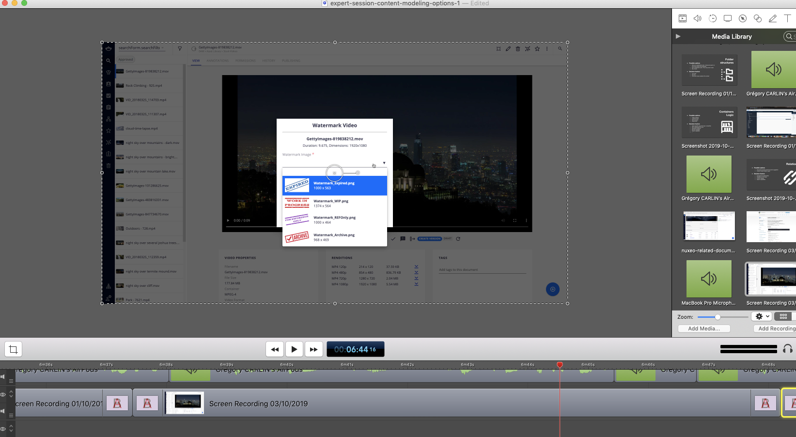

# Custom Document Suggestion



## Prerequisites

- Nuxeo Web UI

## Description

This module helps you build a custom display for your `nuxeo-document-suggestion` element, thanks to the `resultFormatter` element attribute.

## Usage

Customize the document suggestion in any web element and the user will have a rich suggestion instead of having document path suggestions.

## Installation

We will illustrate the installation through an example, with a Document property displaying the chosen image to apply for watermark on the current document.

### Studio Modeler

- Create a custom page provider to list the document which should appear in your suggestion element.
  - `VideoUtils_Watermark_PageProvider`
- Create a property of type `Document` in the schema definition if needed.
  - No the case here in this example

### Studio Designer

- Switch to code on the layout / element which uses the property (converted in `nuxeo-document-suggestion`).
- Edit the element according to your needs

```
<nuxeo-document-suggestion
                    role="widget"
                    id="docSuggWatermark"
                    label="[[i18n('video.watermark.label.watermarkImage')]]"
                    name="watermarkDocId"
                    value="{{watermarkDocId}}"
                    page-provider="VideoUtils_Watermark_PageProvider" // Link to the page provider we've defined before
                    placeholder=""
                    min-chars="0"
                    result-formatter="[[watermarkResultFormatter]]" // Formatter used to create the custom display (HTML)
                    required="true">
</nuxeo-document-suggestion>
```

- Update the default behaviors: The Select2Behavior is required to use escapeHTML().
```
Polymer({
      is: 'video-watermark',
      behaviors: [Nuxeo.LayoutBehavior, Nuxeo.Select2Behavior],
```

- Create a function for a selected entry of the Formatter.

```
/**
         * Formatter for a selected entry.
        */
        watermarkResultFormatter: {
          type: Function,
          value: function() {
            return this._watermarkResultFormatter.bind(this);
          }
        },
```

- Create the Formatter logic and UI:

```
_watermarkResultFormatter: function(doc) {

        if (!doc.properties) {
          return "Bad result format";
        }

        let pictInfo = doc.properties["picture:info"];

        let markup = "";

        markup += "<table width='100%'><tbody>";
        // Title
        markup += "<tr>";
          markup += "<td width='100px' style='text-align: center'>";
            markup += "";
          markup += "</td>";
          markup += "<td>";
            markup += "<div style='margin-left:15px'><span style='font-weight: bold;'>"
              //markup += this.$.escapeHTML(doc.title) +"</span>";
              markup += doc.title +"</span>";
              markup += "<br />" + pictInfo.width + " x " + pictInfo.height;
            markup += "</div>";
          markup += "</td>";
          markup += "</tr>"
        markup += "</tbody></table>";

        return markup;
      }
```

- Notice we want to display the document thumbnail, so we need a specific function to do that:

```
_getThumbnailUrl: function(doc) {
        return "/nuxeo/api/v1/id/" + doc.uid + "/@rendition/thumbnail";
      },
```
