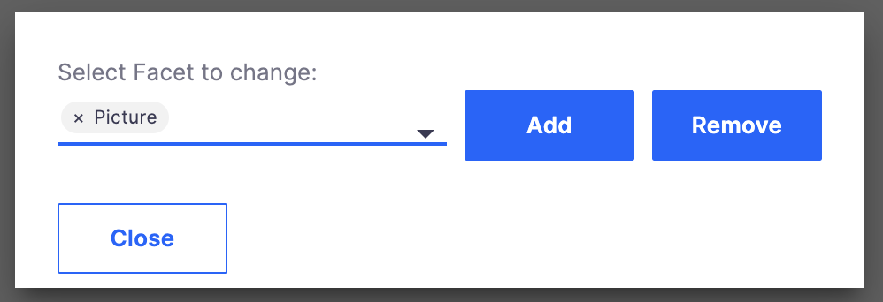

# Edit Facets

## Introduction

Dialog to add or remove facets from any document. Useful for dev/quick tests and troubleshooting.

Includes Automation to get all facets available for the configured application.

## Requirements

* [Nuxeo Web UI](https://doc.nuxeo.com/n/y8x)
* [nuxeo-operation-button-no-icon](../nuxeo-operation-button-no-icon/) Cookbook element

## Installation

* Modeler
  * Create an [XML Extension](https://doc.nuxeo.com/nxdoc/how-to-contribute-to-an-extension/#contributing-using-nuxeo-studio) and copy [AUTOMATION_GETFACETS.xml](modeler/AUTOMATION_GETFACETS.xml), which enables access to necessary classes
  * Create an [Automation Script](https://doc.nuxeo.com/n/E2x) and copy [api_Util_GetAllFacets.js](modeler/api_Util_GetAllFacets.js) to get all facets
* Designer
  * Upload [edit-facets-dialog.html](designer/edit-facets-dialog.html) to the `ui/elements` folder in the **Resources** tab; create this folder if needed
  * Create Custom Button contribution and choose `edit-facets-dialog` as the Element
    * Make sure to bind the Automation Script created above to the `operation` property
    * Make sure to bind `[[document]]` to the `document` property
  * Recommend choosing the "Document Actions" slot, but of course you can enable as desired

## Usage

Use your configured button to open the dialog. Choose a facet from the list, use the available buttons to add or remove the facet.

Keep in mind you can probably break things by adding facets that don't make sense for a given type, or removing important facets. Remember that removing a facet also removes all the associated metadata.

## Documentation

- [Java Objects in Automation Scripting](https://doc.nuxeo.com/nxdoc/automation-scripting/#java-objects-in-automation-scripting)
