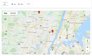

# Geodistance and Google Map Display

Performs a geodistance search ("search all accidents which are 100km around the current accident"), and displays the result in a Google Map, with clickable markers. A click on a marker displays any information you want.



<div style="margin-left:50px;font-style:italic">If you don't need to display the result in a Google Map, you can just ignore everything around it and rework the nuxeo-geodistance-search.hml to display the results in another way.</div>

## Requirements
If you plan to use Google Map, you need a key that enables the [Google Map JavaScript API](https://developers.google.com/maps/documentation/javascript/get-api-key).


## Installation

### Studio Modeler

#### 1. Create the `geoloc` schema

In this example, the UI element expects it to have 3 fields:

  * `latitude`, String or Float
  * `longitude`, String or float
  * `location`, String. **Required**. This field is a concatenation, "latitude,longitude", as required by elasticsearch
  * **NOTICE**: We use an event handler to automatically fill `geoloc:location`. Notice you could also just have the `geoloc:location` field and, in the frontend, parse it to extract latitude and longitude to pass to the Google Map.

Add this schema to the document types that need it. In this example, we will add it to `File`. Notice you could also use a facet, declare the facet in the registry and in the XML (so it is deployed), check the facet for your document(s), etc. We keep it simple in this example.


### 2. Create the `GeolocAboutToCreateOrModif` Event Handler and Chain

Goal: To fill ` geoloc:location` by concatenating `geoloc:latitude` and `geoloc:longitude`. Which means this step is optional is you don't use these fields (and modify the ui element), or if you have another way to set `geoloc:location`.

* Events: `About to create` and `Before document modification`
* Activation:
  * Regular document
  * To make sure the automation wil run only for our documents that do have the `geoloc` schema you can:
    * Either select the document(s) in the list
    * _or_ use a custom EL expression: `Document.doc.hasSchema("geoloc")`
    * _or_, if using a facet, then test on this facet.
* Create the `GeolocAboutToCreateOrModif` chain, and copy the content of `modeler/GeolocAboutToCreateOrModif.js` (in this GitHub repository.)


### 3. Create the `geodistance` Page Provider

* (Use elasticsearch, of course)
* Query Filter: `ecm:isTrashed = 0 AND ecm:isVersion = 0 AND ecm:mixinType != 'HiddenInNavigation'`
* Add a predicate:
  * Field: `geoloc:location`
  * Operator: `IN`
  * Store entered values as list: Checked. This is _very important_. The elasticsearch hints expects a list of exactly 2 elements: The location and the distance. The UI will pass such list.
  * Hints > Operator: `geo_distance` (all this example works around this :-))
    * Expression displayed in the provider: `geoloc:location IN (geoloc_location)`. We will use the `geoloc_location` name as a named parameter of the nuxeo-page-provider UI element.
  * (Optionally, tune the sort order, or other settings if you wish.)


### 4. Create an Operation which Returns the Google Map API key

* Create the `GetGoogleMapApiKey` chain, and copy the content of `modeler/GetGoogleMapApiKey` in this GitHub repository. Input and output type are `void`.
* You don't want to hardcode the value in the frontend
* (You also should limit the key by HTTP callers, this is good practice.)

### Studio Designer

#### 1. Import the `nuxeo-googlemap-elements` Folder

You can find it [here](https://github.com/nuxeo-sandbox/nuxeo-googlemap-elements).

As the time this README is written, you must first create the folder, them upload each file one by one.

<div style="margin-left:50px;font-style:italic">These elements may be moved to nuxeo-studio-community-cookbook, so if you don't find them in nuxeo-sandbox, look for them in nuxeo-studio-community-cookbook.</div>

It contains 2 elements, `nuxeo-google-map` and `nuxeo-google-maps-api`.

#### 2. Import the `nuxeo-geodistance-search.html` Element

<div style="margin-left:50px;font-style:italic">Depending on the location of the element, you may need to change the line that imports <code>nuxeo-google-map.html</code></div>


#### 3. Create a Tab which Displays this Element

* In Designer > UI, create a new Tab of type "Page",and bind it to the element.
* Look at the html of the element to decide if you want to tune the properties, the only one that is required is `[[document]]`.
* Activation filter: Make sure to display the tab only for your documents that really need it. In this example: Filter on the document type, which must be "File".


#### 4. Add the `geoloc` Fields in your Layouts

Unless you are filling everything from REST with no UI, it will help to drop the latitude and longitude fields in your layouts. In this example, add the to the create, edit and metadata layout, so you will be able to enter some values.

### Nuxeo Server

#### 1. Add a Configuration Parameter for the Google Map API Key

Cf. the `GetGoogleMapApiKey` chain created above. It returns the value of the `google.maps.api.key` configuration parameter, which must be set in `nuxeo.conf`. Obviously, if you changed the name of the parameter in the chain, also change it in the `nuxeo.conf`.


#### 2. Deploy a Configuration Template for Elasticsearch Mapping

All this example relies on using Elasticsearch `geo_point` index for our `geoloc:location` field. The only way to change the elastcisearch mapping is to deploy a [configuration template for elasticsearch mapping](https://doc.nuxeo.com/nxdoc/elasticsearch-setup/#changingelasticsearchmapping).

In our example, this means:

* in `{server_home}/templates` copy the whole `configuration-template-example/geoloc-es-mapping` folder
* in `nuxeo.conf`, add this template to the list of templates that are deployed:

```
nuxeo.templates=default,drive,geoloc-es-mapping
```

**IMPORTANT**: of course, if you are tuning this example to adapt to your custom schema field, you will first modify `geoloc-es-mapping/nxserver/config/elasticsearch-doc-mapping.json`: Search for `geoloc:location` and change the xpath used.


#### WARNING: Configuration templates that change the mapping of elasticsearch are not merged

This means, basically, that the last template deployed overrides the others, if any. The last template deployed is the last in the list of `nuxeo.templates`. If you deploy a plugin that already changes the elasticsearch mapping (add more index to some fields, add a feature, ...), you must then create another template that deploys an `elasticsearch-doc-mapping.json` containing all the mapping, merged, and make sure this template is the last one to be deployed.

So, for example, if, after manually modifying `nuxeo.templates` you install a plugin, make sure this plugin does not change the elasticsearch mapping and if it does, modify `nuxeo.templates` again.


## Test
Once your server started and your Studio project deployed, create some documents (in our Example, `File`) with latitude/longitude and test the search.

For your convenience, the `some-locations.csv` file contains 4 `File` document with latitude/longitude (you will need the nuxeo-csv plugin to quickly import them)


## Other Example

This example is about displaying the `nuxeo-geodistance-search` in a view layout, in this example, the view layout of a `File` document:

* (Remove the tab if you created it)
* In Designer, configure the `nuxeo-file-view-layout`:
  * Import the element,
  * Remove the `nuxeo-document-viewer`
  * Just use `nuxeo-file-view-layout`

(of course, this example is a bit silly: One would most likely want to display the preview of a `File`):

```<link rel="import" href="../../nuxeo-geodistance-search.html">
<dom-module id="nuxeo-file-view-layout">

  <template>
    <style>
    </style>
    
    <nuxeo-geodistance-search document="[[document]]"></nuxeo-geodistance-search>

  </template>

  • • •

</dom-module>

```

## Documentation

- [Elasticsearch hints](https://doc.nuxeo.com/nxdoc/nxql/#elasticsearch-nxql-hints)
- [Configuration template for elasticsearch mapping](https://doc.nuxeo.com/nxdoc/elasticsearch-setup/#changingelasticsearchmapping)
