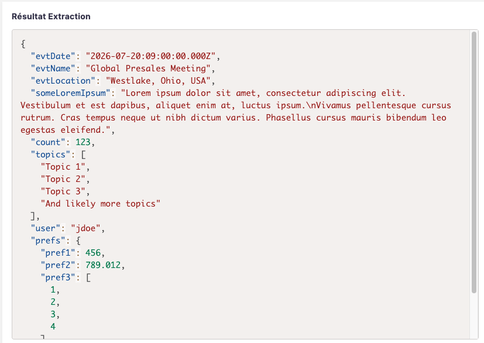

# json-display

`json-display` displays a JSON string in a readable way, in black/white or using [Prims.js](https://prismjs.com/) to apply JSON syntax coloring.




## Usage

Once all files are installed (see "Installation" below), in the element in which you want to display this colored JSON:

```html
<!-- Adapt path, depends on where yourcurrent element is. For example, in a View layout (at document/mydoc/nuxeo-mydoc-view-layout.html) -->
<link rel="import" href="../../json-display/json-display.html">

. . . other elements . . .

<json-display json-str="[[document.properties.mydoc:fieldWithAJsonString]]"></json-display>

. . .
```

## Installation

### Studio Designer

In "Resources", create the "json-display" folder and upload the files found in "for-Studio-Designer":

#### With Syntax Coloring

* json-display.html
* prism.css
* prism.js

#### With No Syntax Coloring

Just upload json-display-no-colors.html.

## Long Lines and Wrapping

The element is configured to wrap long JSON string values.

This avoids horizontal scrolling when the JSON contains long text values, URLs, IDs, tokens, or other long strings.

The relevant CSS rules are inside the element and can be adjusted directly if needed.

## Changing Syntax Coloring (`json-display` element)

To change the syntax colors, modify the CSS directly inside `json-display.html`.

The Prism token classes used for JSON are typically:

```
.token.property
.token.string
.token.number
.token.boolean
.token.null
.token.punctuation
```

For example, to make JSON properties blue and string values red, update the CSS rules in the element:

```css
.json-container code[class*="language-"] .token.property {
  color: #0451a5 !important;
}

.json-container code[class*="language-"] .token.string {
  color: #a31515 !important;
}
```

## About Prism.js for JSON Syntax Coloring

- See Prism.js at [prismjs.com](https://prismjs.com/).
- Source code of Prism is available on GitHub: [github.com/PrismJS/prism](https://github.com/PrismJS/prism).
- Notice: Prism is licensed under the [MIT License](https://github.com/PrismJS/prism/blob/v2/LICENSE), which is business friendly.


