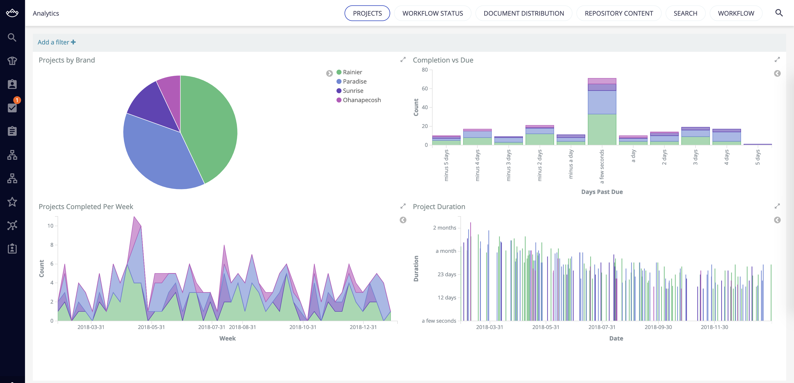

# Analytics with Kibana

## Description

Module for generating data to be used in a Kibana dashboard, and displayed in the "Analytics" area of Web UI.

## Usage

Module for generating data to be used in a Kibana dashboard, and displayed in the "Analytics" area of Web UI.

This module supports a "story" that the duration of content with completion dates decreases over time, because Nuxeo makes things more efficient. It uses a exponential function, with some jiggle, to create this trend. Note the "Project Duration" graph:

Note that while the data is contrived, the metrics and analytics *are* data-driven.  In other words, if the application was filled with "real" data, the analtyics would still work, we just happen to be filling it with artificial data.

You can access the analtyics from:
* Admin -> Metrics Setup -> generate data for metrics
* Admin -> Analytics -> the default analytics tab should display your Kibana dashboard

## Installation

### Studio Modeler

1. Install TRK_METRICS.xml as an XML Extension
2. Install the scripts in the `modeler` folder as Automation Scripts
3. Modify `trk_GenerateData_Docs` to suit your use case

### Studio Designer

1. Install the content in the `ui` folder as Resources in Designer (including the subfolders)

## Configuration

### Modeler

* Create a Vocabulary for metrics units
  * id = `trk_metrics_units`
  * *id/label - order*
  * ms - 0
  * secs - 1
  * mins - 2
  * hours - 3
  * days - 4

* Create a schema for metrics data
  * id = `trk_metrics`
  * prefix = `trk`
  * `completion_duration` - Integer
  * `completion_end` - Date
  * `completion_start` - Date
  * `completion_units` - Directory bound to `trk_metrics_units` - default `ms`
  * `due_date` - Date
    * Note: requires standalone ES to be useful

### Designer

* Translation keys:
  * `app.title.admin.trkMetricsButtons` <- title to display when the Metrics Setup screen is displayed

### Kibana

Note: this is not an explanation of how to use Kibana, it's just a list of things that need to be created for the default implementation. Kibana how-tos are documented elsewhere.

* Create a query to locate the metrics documents. There are several ways you can do this:
  * Filter for the `Metrics` facet
  * Filter for the duration `trk\:completion_duration > 0`
  * The main thing to keep in mind is that you might want to include "real" documents as well, not just the generated ones
* Create 3-4 Visualizations
  * Pie chart docs by "category" (dc:nature by default)
  * (optional) Stacked Bar chart for Completion Date vs Due Date (was the task completed on time, late, ahead of time?)
    * This one requires standalone ES with a scripted field:
      * `doc['trk:completion_end'].value - doc['project:due_date'].value`
    * X-axis by `terms` on the above field
    * Split series by "category"
  * Area Chart for Completed per week
    * X-axis Date Historgram by `trk:completion_end`
    * Split Series by "category"
  * Bar Chart for Duration
    * Y-axis Average for `trk:completion_duration`
    * X-axis Date Histogram with `trk:completion_end`, interval `Daily`
    * Split series by "category"
* Create a dashboard with your visualizations
* Set the Dashboard URL in Designer in trk-metrics-analytics-layout.html
