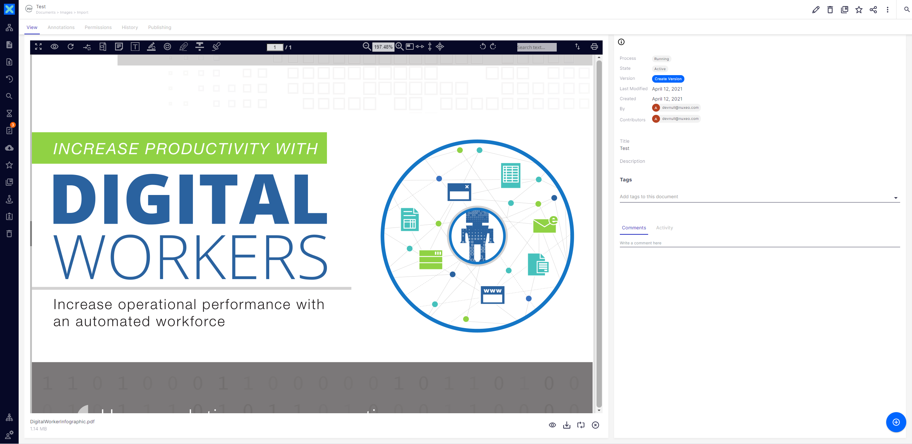

# Nuxeo Enhanced Viewer Document Preview

## Prerequisites

- Nuxeo Web UI
- [Nuxeo Enhanced Viewer](https://doc.nuxeo.com/nxdoc/nuxeo-enhanced-viewer/)

## Description

This contribution provides and easy way to user the NEV viewer as the default viewer for a configured list of mimetypes.  

## Usage

After adding the `nev-document-viewer` element to the document view page, the Nuxeo Enhanced viewer will be shown instead of
the OOTB Nuxeo Document Viewer for most document, audio, and video documents.

The `nev-document-viewer` will fallback to the OOTB viewer if the blob's mimetype is not included in the list of specified mimetypes. This behavior can
be modified to look at features of the document such as facets and document properties.

## Installation

### Studio Modeler

No configuration is required for Studio Modeler.

### Studio Designer

1. Copy all the files contained in the `designer` folder to Studio Designer (under the `UI` folder).
2. Add the `<nev-document-viewer role="widget" document="[[document]]"></nev-document-viewer>` element definition
to each document type's view element file (ex: `UI/document/picture/nuxeo-picture-view-layout.html`). Remove the default `nuxeo-document-viewer` element from the view.
3. Add the following lines to your custom bundle file:

        <link rel="import" href="nev/nev-document-viewer.html">
        <link rel="import" href="nev/nev-document-preview.html">
    

## Configuration

The logic of when to show the Nuxeo Enhanced Viewer is configured in the `_checkNEVViewerMimetypes` method of the `nev-document-viewer` element.
This behavior can be easily modified to allow different logic to take place, such as only showing the viewer when a document 
has a specific facet, or property. 
