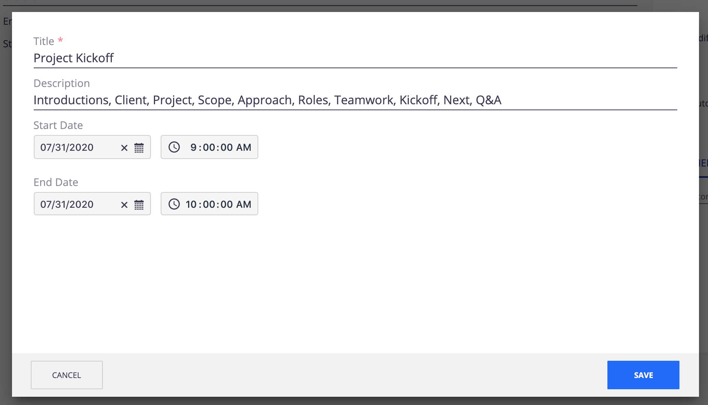

# Nuxeo Date Time Picker



## Prerequisites

- Nuxeo Web UI

## Description

This modules provides a visual element to select both the date and time:
- Displays times in local timezone of browser
- Use 12-hour clock with AM/PM selector (or a 24-hour clock, see `hour24`)

## Usage

On any `Date` field, use:

```html
<nuxeo-custom-date-time-picker
  role="widget"
  label="Expire date"
  value="{{document.properties.dc:expired}}">
</nuxeo-custom-date-time-picker>
```

With no AM/PM but full time (0-23h):

```html
<nuxeo-custom-date-time-picker
  role="widget"
  label="Expire date"
  hour24
  value="{{document.properties.dc:expired}}">
</nuxeo-custom-date-time-picker>
```

The full list of options are:

```html
<nuxeo-custom-date-time-picker
  role="widget"
  default-time="17:30:00.000"
  error-message="Please enter a valid date and time"
  hour24
  id="expired"
  label="Expiry Date"
  name="expired"
  required
  show-millis
  show-seconds
  value="{{document.properties.dc:expired}}"
  >
</nuxeo-custom-date-time-picker>
```
with: 
- `default-time` ("00:00:00.000" by default)
- `error-message`
- `hour24`
  - `false` by default; when set, uses a 24-hour clock — e.g. `23:45` — and hides the AM/PM selector
  - Reminder: With Polymer, either you pass the property or not. If passed, it is always `true`. So passing `hours24="false"` still makes it `true`.
- `show-millis` (false by default)
- `show-seconds` (false by default)

## Installation

### Studio Modeler

- Add the following XML extension under **CONFIGURATION** > **Advanced Settings** > **XML Extensions**:

```xml
<extension
  target="org.nuxeo.runtime.ConfigurationService"
  point="configuration">

  <!-- Date (time) format -->
  <property name="org.nuxeo.web.ui.dateFormat">LL LTS</property>
  <property name="org.nuxeo.web.ui.dateTimeFormat">dddd, LL LTS</property>

  <!-- First Day Of Week -->
  <property name="org.nuxeo.web.ui.firstDayOfWeek">1</property>

</extension>
```

### Studio Designer

- Copy the folder of the `designer` subfolder under the `UI` folder of the **Resources** tab of Nuxeo Studio Designer.
- Add the following contribution in your custom bundle file:
```
<link rel="import" href="custom-elements/nuxeo-custom-date-time-picker.html">
```
- Add the following translation keys in your `messages.json` file:
```
"label.time.picker.ampm.am": "AM",
"label.time.picker.ampm.pm": "PM"
```
> These `ampm` keys are only used by the 12-hour clock. If every widget uses `hour24`, they are not required.
