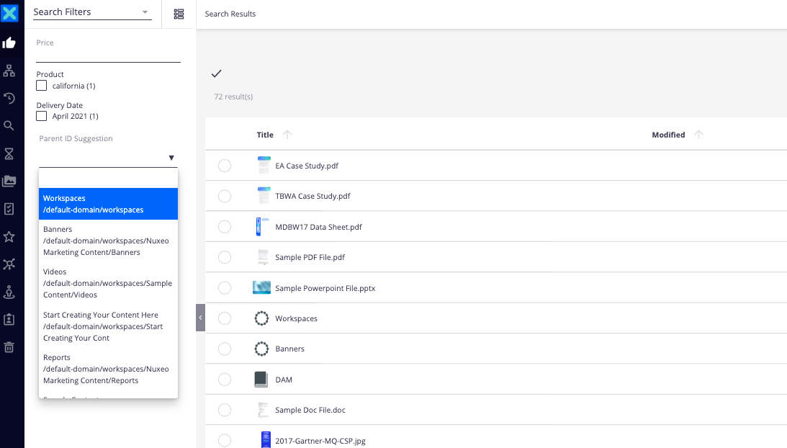

# Search via Parent Container



## Prerequisites
Nuxeo Server LTS 2021 / Nuxeo Server LTS 2019


## Description

This module helps you build an interactive search form in the Nuxeo WebUI that allows users to search via a document's parent container.

Based on the modeler configuration, you will see there is a page provider created called `ACMESearch` with one predicate: `ecm:parentId`. There is one additional page provider configured called `ContainerDocPP` which is utilized in the `nuxeo-document-suggestion` widget we will be adding so that only container documents are pulled as options to filter by. The page provider search form and search results layouts should be scaffolded using the Designer default scaffolding settings. The search form is then enhanced by replacing the text field utilized to search for the `ecm:parentId` with the `nuxeo-document-suggestion` widget. 

The code in question which allows us to very easily search for a document via it's parent container is seen below:
```
<nuxeo-document-suggestion role="widget" label="Parent ID Suggestion" value="{{params.system_parentId}}" placeholder="" min-chars="0" page-provider="ContainerDocPP"></nuxeo-document-suggestion>
```

The base query for the `ContainerDocPP` can be seen in the modeler/extensions.xml file or below:
```
SELECT * FROM Document WHERE (ecm:mixinType != 'HiddenInNavigation' AND ecm:isVersion = 0 AND ecm:isTrashed = 0 AND ecm:mixinType = 'Folderish' AND ecm:fulltext = '?*')
```

## Usage

Add the additional page provider ie `ContainerDocPP` and the `nuxeo-document-suggestion` widget to search for documents via their parent containers.

## Installation

### Studio Modeler
Create an XML extension using `extensions.xml`. This should give you a basic data model and page provider. 


## Documentation Links
[Nuxeo Web Components](https://www.webcomponents.org/element/nuxeo/nuxeo-ui-elements)

