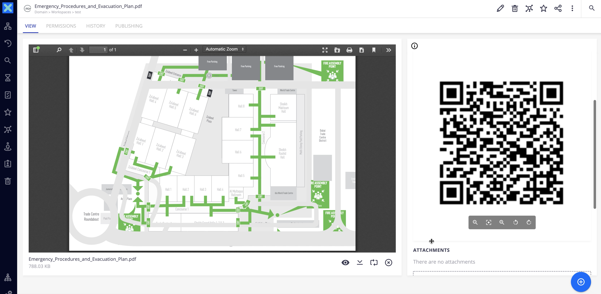

# QR Code



## Prerequisites

- Access to Internet (http://chart.googleapis.com/chart REST API Calls)

## Description

This module allows you to generate a QR Code when a document is created in the platform. The QR Code points to the main file (i.e. `file:content`) by default.

## Usage

- Drag and drop a file
- Scan the QR code from the metadata layout
- Authenticate and download the file

## Installation

### Studio Modeler

- Create a blob property to store the QR Code. In this example, we've imported the `File` document type with the DM External Template and create a property from its type schema `file_schema:qrcode`
- Create an automation scripting with the content of `AS_GenerateQRCode.js`, with input as `Document` and output as `blob`
- Create an event handler on the `Document Created` event to execute the previous automation scripting

### Studio Designer

- Insert the Nuxeo previewer in the document type layout

```
<nuxeo-document-preview document="[[document]]" xpath="file_schema:qrcode"></nuxeo-document-preview>
```

## Configuration

- You can choose to store the QR Code in any document property

## Documentation Links

- [HOWTO: Create and Reuse a Custom Element](https://doc.nuxeo.com/nxdoc/how-to-create-and-reuse-custom-element/)
- [HOWTO: Customize Document Layouts](https://doc.nuxeo.com/nxdoc/web-ui-document-layouts/)
- [Web UI Layout Elements](https://doc.nuxeo.com/nxdoc/web-ui-layouts/)

## Issues and Limitations

- You cannot use the **Document** URL instead of the **File** URL because of the `#` character: even if it is encoded in the automation scripting, it is not decoded on Google side, building an incorrect URL
