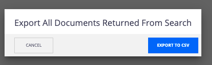

# Select All Bulk Action

## Prerequisites
Nuxeo Server LTS 2019, Version for LTS 2021 in progress

## Description

This module helps you add a button to the view of search results that will take all of the contents/results and send to a predefined bulk action. This will not automatically check all of the checkboxes in the result view list.

Based on the modeler configuration, you will see there is a page provider created called `ACMESearch` with one predicate: `dc:title`. The page provider search for and search results layouts should be scaffolded using the Designer default scaffolding settings. The search results form is then enhanced such that a Bulk Action button is available to send documents from the search results to be exported via CSV.

Select All Bulk Action has been implemented in the `nuxeo-acmesearch-search-results.html` found in the Designer folder. We take the page provider and parameters passed into the page provider (price, product, delivery date -- if they were filled in) and call `Bulk.RunAction`, which is an OOTB Nuxeo operation meant to run an action utilizing the Bulk Action Framework.

## Usage

Button can be utilized from a search result layout.

## Installation

### Studio Modeler
Create an XML extension using `extensions.xml`. This should give you a basic data model and page provider. 

## Documentation Links
[Bulk Action Framework](https://doc.nuxeo.com/nxdoc/bulk-action-framework/)

