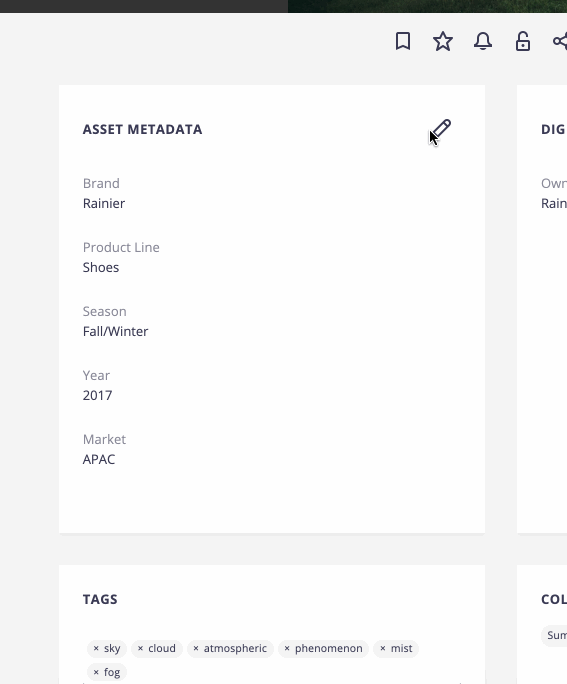

# Toggleable Form

## Prerequisites

- Nuxeo Web UI installed

## Description

WebUI Element to allow "inline" metadata editing. Consists of a `paper-card` that displays the Metadata or Edit layout of the passed document, as appropriate.

## Usage

Clicking on the pencil icon of the card allows you to switch to the edit view. Click on the "Save" card button once finished.

## Installation

### Studio Designer

* Install `toggleable-form.html` in your WebUI resources and import them in your bundle
* Add `<toggleable-form>`'s to your layouts, for example:
  * `<toggleable-form document="[[document]]" title="[[document.properties.dc:title]]"></toggleable-form>`

## Documentation Links

  - [HOWTO: Create and Reuse a Custom Element](https://doc.nuxeo.com/nxdoc/how-to-create-and-reuse-custom-element/)
  - [HOWTO: Customize Document Layouts](https://doc.nuxeo.com/nxdoc/web-ui-document-layouts/)
  - [Web UI Layout Elements](https://doc.nuxeo.com/nxdoc/web-ui-layouts/)
