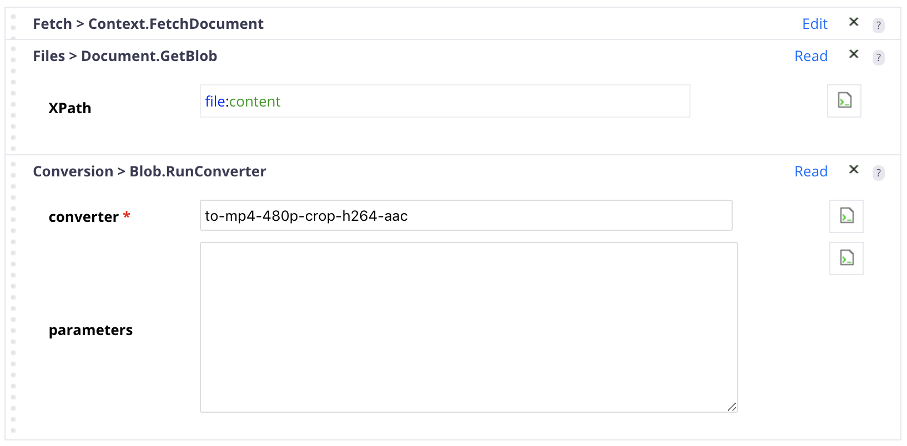

# Video converters

## Prerequisites

- Nuxeo DAM installed with `ffmpeg` installed.

## Description

This example adds includes several additional video conversions that can be contributed via Studio.

## Usage

Use the converters in any `Blob.RunConverter` automation operation with the expected converter options.

## Installation

### Studio Modeler

Create an XML extension with the content of `video_conversions.xml`.

## Documentation Links

- [DAM](https://doc.nuxeo.com/nxdoc/dam/)
