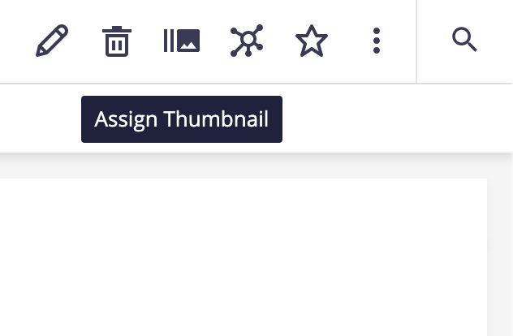
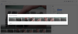

# Video thumbnail

## Prerequisites

- Nuxeo DAM installed

## Description

Module for setting the video poster and search thumbnail.

## Usage

Click on the 'burst-mode' icon for the Video to set the storyboard thumbnail.

## Installation

### Studio Modeler

- Add `SetThumbnailByTimecode.js` as an automation script

### Studio Designer

- Upload the UI elements to the Designer tab
- Add the bundle.html snippet to your project's configuration in Designer

## Issues and Limitations

- Sometimes the browser cache caused an image to not be updated
