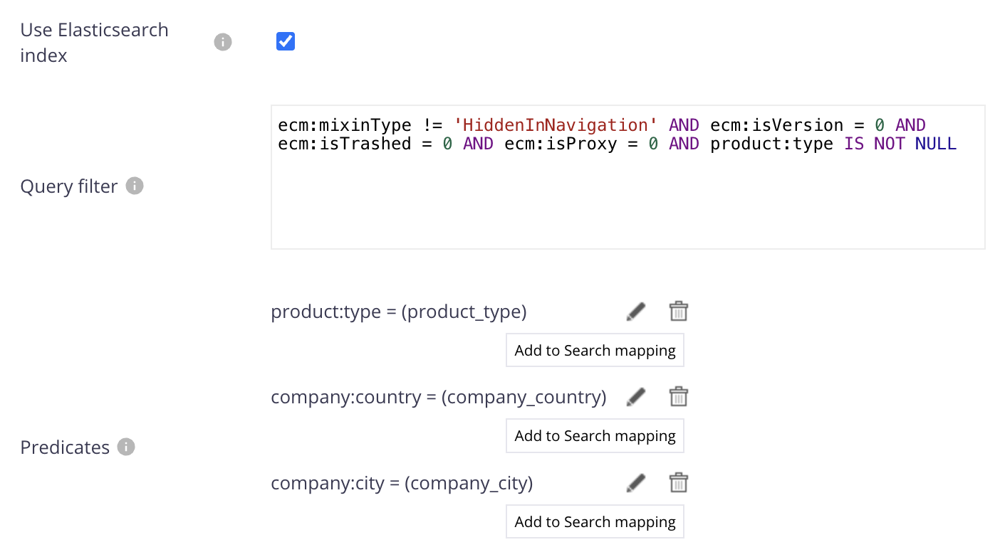
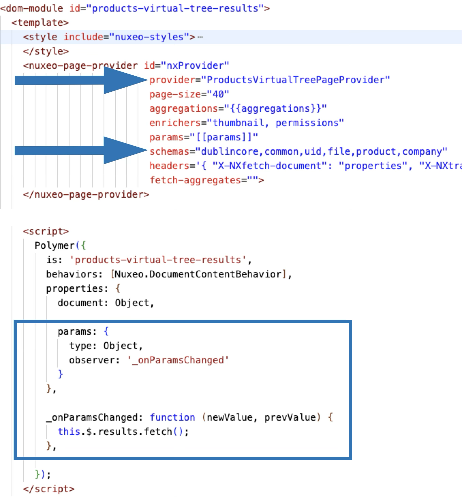

# Nuxeo Virtual Tree Navigation

The `virtual-tree` element allows for building a virtual navigation with a tree view on the left and the list of corresponding documents on the right.


The element calls an operation server side that returns the expected configuration for the tree, allowing to display different virtual tree views, with based on different fields. You can also just change the `virtual-tree` and hard code the value if you wish, of course.

The expected JSON has 2 required properties:

* "resultLayout" is the name of a result layout to use. It must have been preload from your custom bundle (see below)
* "levels" is an array of objects
  * The order is important: First element is first level of tree view. Second element, the second level, etc.
  * Each object has 2 required properties:
    * "field", the XPAH of the corresponding field
    * "label", the label to use in the UI
    * "ppParameter", the corresponding parameter used in the page provider linked to the result layout. (see below)

For example, in a tree view displaying Products > Countries > Cities, you would have:

```
{
  "resultLayout": "products-virtual-tree-results",
  "levels": [
    {
      "field": "product:type",
      "label": "Product",
      "ppParameter": "product_type"
    }, {
      "field": "company:country",
      "label": "Country",
      "ppParameter": "company_country"
    }, {
      "field": "company:city",
      "label": "City",
      "ppParameter":
      "company_city"
    }
  ]
}
```

## Prerequisites

* Nuxeo Web UI

## Installation

### Studio Modeler

* Create a Page Provider to be used by the result layout in Designer
  * The Page provider _must_ use predicates for each level of the virtual tree
  * Take note of their names (used in the JSON configuration)
  * The default search should correspond to the initial loading when the user has not yet selected anything. So with our examples of Products > Countries > Cities, your PageProvider would be (initial `product:type IS NOT NULL` allows for the displaying all documents with a product when at first load):




* Create an operation that returns the configuration. For example a JS automation named `ProductCountriesCitiesConfig`.

Input is `void`, output is `blob`. With previous example you wopuld have:

```javascript
function run(input, params) {
  
  var config = {
    "resultLayout": "products-virtual-tree-results", // Must have been preloaded in the bundle
    "levels": [
      {
        "field": "product:type",
        "label": "Product",
        "ppParameter": "product_type"
      }, {
        "field": "company:country",
        "label": "Country",
        "ppParameter": "company_country"
      }, {
        "field": "company:city",
        "label": "City",
        "ppParameter":
        "company_city"
      }
    ]
  };
  
  return org.nuxeo.ecm.core.api.Blobs.createJSONBlob(JSON.stringify(config));
}
```


### Studio Designer

1. Import the `virtual-tree`
  * open it and modify the `nuxeo-operation` in order to call your operation
2. Create a result layout
  * 💡: Generate a view layout for a folderish. Use the table editor to easily drag and drop your fields
  * Then, copy the content (think about renaming the element ID) in your new result layout
3. Modify the result layout:
  * (Look at the example at Example Result Layout/products-virtual-tree-results.html)
  * Change the name of the provider used. In our example: `<nuxeo-page-provider ... provider="ProductsVirtualTreePageProvider" ...`
  * Add the schemas you need for display in the results. In our example: `<nuxeo-page-provider ... schemas="dublincore,common,uid,file,product,company" ...`
  * Add the `params` properties, with a listener that triggers the search.
  * Here is an example:



> [!WARNING]
> In this screenshot, `results` in `this.$.results` is the ID of the `nuxeo-results`. Obviously, if you are using another way to display data, adapt accordingly.

4. Preload the result layout
  * This is required, so it can be dynamically injected in the element
  * Create a custom bundle and just import the layout. For example:

`<link rel="import" href="nuxeo-virtual-tree/products-virtual-tree-results.html">`.

#### Displaying the Virtual Tree

Here is an example deploying the tree in a tab, at Domain level:

1. Create a new element that is super simple: It just uses `virtual` tree (here, named `virtual-tree-tab`)

```html
<link rel="import" href="virtual-tree.html">
<dom-module id="virtual-tree-tab">
  <template>
    <style include="nuxeo-styles"></style>
    <dynamic-virtual-tree></dynamic-virtual-tree>
  </template>

  <script>
    Polymer({
      is: 'virtual-tree-tab',
      behaviors: [Nuxeo.LayoutBehavior],
      properties: {
        document:Object
      }
    });
  </script>
</dom-module>
```

2. In "UI" of Designer, create a new Tab, of type Page and
  * Use this element
  * Set up the filter accordingly


## Known Limitation

If displaying the results use a page provider and can, then display thousands, billions of documents, it is not the case for the values fetched for the tree.

So, basically, there is room for improvement here :-)