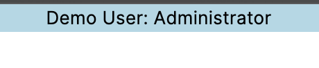

# Web UI User Header



## Prerequisites

- Nuxeo Web UI
- Nuxeo Studio project

## Description

This module adds a small header to the top of Nuxeo Web UI that displays the current logged in user's username. This is based on https://doc.nuxeo.com/nxdoc/how-to-add-a-header-and-a-footer/ but I found that the example code creates a header that doesn't always update so I modified it more consistently load the info.

## Installation

Add this in your Web UI theme(s) HTML in Designer:

```css
      /* Provide space for custom header that displays current user (see custom
      bundle) */
      --nuxeo-app-top: 20px;
```

Add this in your custom bundle; if you don't yet have a custom bundle, go to Designer -> Resources tab -> click the default bundle file, Designer will ask you if you want to create a custom bundle.

```html
<!-- Add a header that displays the current user, to make demoing multiple roles easier -->
<script>
  Polymer({
    _template: Polymer.html`
      <style>
        :host {
          @apply --layout-horizontal;
          @apply --layout-center;
          background-color: lightblue;
          color: black;
          text-align: center;
          height: 20px;
          width: 100%;
        }
        span {
          @apply --layout-flex;
        }
      </style>

      <span>Demo User: [[user.id]]</span>
    `,
    is: 'my-header',
    properties: {
      user: Object
    },
  });

  const myHeader = document.createElement('my-header');
  document.body.appendChild(myHeader);

  const app = document.querySelector('nuxeo-app');
  customElements.whenDefined('nuxeo-app').then(() => {
    myHeader.user = app.$.nxcon.user;
    app.$.nxcon.addEventListener('user-changed', ({ detail: { value: user } }) => {
      myHeader.user = user;
    });
  });
</script>
```

## Documentation Links

- [DAM](https://doc.nuxeo.com/nxdoc/dam/)
- [HOWTO: Create and Reuse a Custom Element](https://doc.nuxeo.com/nxdoc/how-to-create-and-reuse-custom-element/)
